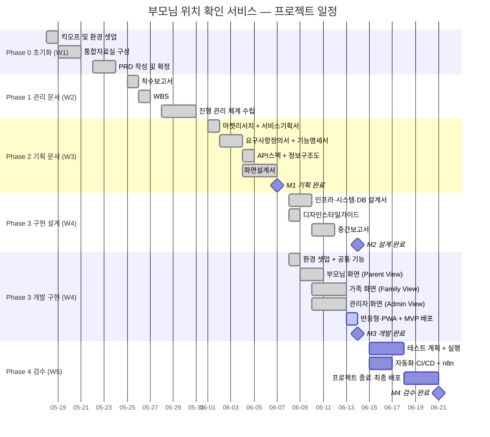

# WBS (Work Breakdown Structure)

| 항목 | 내용 |
|------|------|
| 프로젝트명 | 부모님 위치 확인 서비스 |
| 문서 번호 | DOC-02 |
| 문서 버전 | v1.1 |
| 작성일 | 2026-05-29 (최종 수정 2026-06-08) |
| 작성자 | PM |
| 참조 문서 | 착수보고서.md |
| 프로젝트 기간 | 2026-05-18 ~ 2026-06-21 (5주) |
| 공수 단위 | pd (person-day, 1인 1일) |
| 담당 약어 | PM / FE(프론트엔드) / BE(백엔드) / UX(UX·UI 디자이너) / QA |

---

## 1. WBS 전체 구조



---

## 2. Phase 0: 프로젝트 초기화 (W1, 05-18 ~ 05-24)

| WBS ID | Lv | 태스크명 | 담당 | 공수(pd) | 시작일 | 종료일 | 산출물 | 상태 |
|--------|----|----------|------|----------|--------|--------|--------|------|
| **0** | 1 | **프로젝트 초기화** | PM | **4.0** | 05-18 | 05-24 | | |
| 0.1 | 2 | 킥오프 및 환경 셋업 | PM | 1.5 | 05-18 | 05-19 | | |
| 0.1.1 | 3 | 킥오프 미팅 진행 | PM, 전체 | 0.5 | 05-18 | 05-18 | 회의록 | 완료 |
| 0.1.2 | 3 | GitHub 저장소 셋업 (브랜치 전략, 이슈 템플릿) | PM | 0.5 | 05-18 | 05-18 | GitHub Repo | 완료 |
| 0.1.3 | 3 | Slack 채널 구성 + n8n GitHub-Slack 연동 | PM | 0.5 | 05-19 | 05-19 | n8n WF-01 | 완료 |
| 0.2 | 2 | 통합자료실 구성 | PM | 1.5 | 05-19 | 05-21 | | |
| 0.2.1 | 3 | 00.통합자료실 폴더 구조 셋업 | PM | 0.5 | 05-19 | 05-19 | 통합자료실 README | 완료 |
| 0.2.2 | 3 | 참조 자료 수집 및 등록 (위치정보법 등) | PM | 0.5 | 05-20 | 05-20 | 정책자료, 참고자료 | 완료 |
| 0.2.3 | 3 | NotebookLM 노트북 생성 + 소스 일괄 등록 | PM | 0.5 | 05-21 | 05-21 | NLM 노트북 | 완료 |
| 0.3 | 2 | PRD 작성 및 검토 | PM | 1.0 | 05-22 | 05-24 | | |
| 0.3.1 | 3 | PRD.md 초안 작성 | PM | 0.5 | 05-22 | 05-22 | PRD.md | 완료 |
| 0.3.2 | 3 | PRD 이해관계자 검토 및 확정 | PM | 0.5 | 05-23 | 05-24 | PRD.md v1.0 | 완료 |

---

## 3. Phase 1: 관리 문서 (W2, 05-25 ~ 05-31)

| WBS ID | Lv | 태스크명 | 담당 | 공수(pd) | 시작일 | 종료일 | 산출물 | 상태 |
|--------|----|----------|------|----------|--------|--------|--------|------|
| **1** | 1 | **관리 문서** | PM | **4.0** | 05-25 | 05-31 | | |
| 1.1 | 2 | 착수보고서 | PM | 1.5 | 05-25 | 05-26 | | |
| 1.1.1 | 3 | 착수보고서 초안 작성 | PM | 1.0 | 05-25 | 05-25 | 착수보고서.md | 완료 |
| 1.1.2 | 3 | 착수보고서 검토 및 승인 | PM | 0.5 | 05-26 | 05-26 | 착수보고서 승인본 | 완료 |
| 1.2 | 2 | WBS | PM | 1.5 | 05-26 | 05-27 | | |
| 1.2.1 | 3 | WBS Level 3 작성 | PM | 1.0 | 05-26 | 05-26 | WBS.md | 완료 |
| 1.2.2 | 3 | GitHub Milestones 및 Labels 설정 | PM | 0.5 | 05-27 | 05-27 | GitHub Milestones | 완료 |
| 1.3 | 2 | 진행 관리 체계 수립 | PM | 1.0 | 05-28 | 05-31 | | |
| 1.3.1 | 3 | GitHub Issues 일괄 생성 (WBS 기반) | PM | 0.5 | 05-28 | 05-28 | GitHub Issues | 완료 |
| 1.3.2 | 3 | 주간보고서 1호 발행 (W1-W2 기준) | PM | 0.5 | 05-29 | 05-29 | 주간보고서.md | 완료 |

---

## 4. Phase 2: 기획 문서 (W3, 06-01 ~ 06-07) — M1: 기획 완료

| WBS ID | Lv | 태스크명 | 담당 | 공수(pd) | 시작일 | 종료일 | 산출물 | 상태 |
|--------|----|----------|------|----------|--------|--------|--------|------|
| **2** | 1 | **기획 문서** | PM, UX, BE | **14.0** | 06-01 | 06-07 | | |
| 2.1 | 2 | 시장 분석 | PM | 2.0 | 06-01 | 06-02 | | |
| 2.1.1 | 3 | 마켓리서치 작성 (경쟁사 분석, 사용자 조사) | PM | 1.0 | 06-01 | 06-01 | 마켓리서치.md | 완료 |
| 2.1.2 | 3 | 서비스기획서 작성 | PM | 1.0 | 06-02 | 06-02 | 서비스기획서.md | 완료 |
| 2.2 | 2 | 요구사항 정의 | PM, BE | 3.0 | 06-02 | 06-04 | | |
| 2.2.1 | 3 | 요구사항정의서 작성 (기능/비기능) | PM | 1.0 | 06-02 | 06-02 | 요구사항정의서.md | 완료 |
| 2.2.2 | 3 | 기능명세서 작성 (CMN/PAR/FAM/ADM) | PM, BE | 1.5 | 06-03 | 06-03 | 기능명세서.md | 완료 |
| 2.2.3 | 3 | 기능명세서 검토 및 확정 (M1 전제조건) | PM | 0.5 | 06-04 | 06-04 | 기능명세서 확정본 | 완료 |
| 2.3 | 2 | 설계 기획 (기능명세서 완료 후 병렬 실행) | BE, UX, PM | 9.0 | 06-04 | 06-07 | | |
| 2.3.1 | 3 | API스펙 작성 (REST + WebSocket 엔드포인트) | BE | 1.5 | 06-04 | 06-05 | API스펙.md | 완료 |
| 2.3.2 | 3 | 정보구조도 작성 (화면 계층 + 메뉴 구조) | PM, UX | 1.0 | 06-04 | 06-04 | 정보구조도.md | 완료 |
| 2.3.3 | 3 | 화면설계서 작성 (부모님/가족/관리자 전 화면) | UX | 3.0 | 06-04 | 06-06 | 화면설계서.md | 완료 |
| 2.3.4 | 3 | 화면설계서 검토 및 피드백 반영 | UX, PM | 1.0 | 06-06 | 06-07 | 화면설계서 확정본 | 완료 |
| 2.3.5 | 3 | 주간보고서 2호 발행 | PM | 0.5 | 06-05 | 06-05 | 주간보고서.md | 완료 |
| 2.3.6 | 3 | **M1: 기획 완료 검토** | PM | 0.5 | 06-07 | 06-07 | M1 체크리스트 | 완료 |

> **병렬 실행 가능 (기능명세서 확정 후)**: 2.3.1 API스펙 / 2.3.2 정보구조도 / 2.3.3 화면설계서 동시 착수 가능

---

## 5. Phase 3: 구현 설계 (W4, 06-08 ~ 06-14) — M2: 설계 완료

| WBS ID | Lv | 태스크명 | 담당 | 공수(pd) | 시작일 | 종료일 | 산출물 | 상태 |
|--------|----|----------|------|----------|--------|--------|--------|------|
| **3** | 1 | **구현 설계** | BE, UX, PM | **8.5** | 06-08 | 06-12 | | |
| 3.1 | 2 | 아키텍처 및 시스템 설계 | BE | 4.0 | 06-08 | 06-10 | | |
| 3.1.1 | 3 | 인프라아키텍처 작성 (Vercel + Supabase 구성) | BE | 1.0 | 06-08 | 06-08 | 인프라아키텍처.md | 완료 |
| 3.1.2 | 3 | 시스템정의서 작성 (컴포넌트 + 통신 흐름) | BE | 1.0 | 06-08 | 06-09 | 시스템정의서.md | 완료 |
| 3.1.3 | 3 | 데이터베이스설계서 작성 (ERD + 테이블 정의) | BE | 1.5 | 06-09 | 06-10 | 데이터베이스설계서.md | 완료 |
| 3.1.4 | 3 | DB 스키마 Supabase 적용 | BE | 0.5 | 06-10 | 06-10 | Supabase 테이블 | 완료 |
| 3.2 | 2 | UX/UI 설계 가이드 | UX | 2.0 | 06-08 | 06-09 | | |
| 3.2.1 | 3 | 디자인 토큰 정의 (색상·타이포·간격) | UX | 1.0 | 06-08 | 06-08 | 디자인스타일가이드.md | 완료 |
| 3.2.2 | 3 | 컴포넌트 스타일 가이드 (버튼·입력·카드) | UX | 1.0 | 06-09 | 06-09 | 디자인스타일가이드.md | 완료 |
| 3.3 | 2 | 중간보고 | PM | 1.5 | 06-10 | 06-12 | | |
| 3.3.1 | 3 | 중간보고서 작성 | PM | 1.0 | 06-10 | 06-11 | 중간보고서.md | 완료 |
| 3.3.2 | 3 | 주간보고서 3호 발행 | PM | 0.5 | 06-12 | 06-12 | 주간보고서.md | 완료 |

> **병렬 실행 가능 (화면설계서 + API스펙 완료 후)**: 3.1.1 인프라 / 3.1.3 DB설계서 / 3.2.1 디자인스타일가이드 동시 착수 가능

---

## 6. Phase 3: 개발 구현 (W4, 06-08 ~ 06-14) — M3: 개발 완료

| WBS ID | Lv | 태스크명 | 담당 | 공수(pd) | 시작일 | 종료일 | 산출물 | 상태 |
|--------|----|----------|------|----------|--------|--------|--------|------|
| **4** | 1 | **개발 구현** | FE, BE | **22.5** | 06-08 | 06-14 | | |
| 4.1 | 2 | 개발 환경 셋업 | FE, BE | 1.5 | 06-08 | 06-08 | | |
| 4.1.1 | 3 | Next.js 프로젝트 초기 셋업 (App Router) | FE | 0.5 | 06-08 | 06-08 | src/frontend/ | 예정 |
| 4.1.2 | 3 | Vercel 프로젝트 연결 + 환경변수 등록 | BE | 0.5 | 06-08 | 06-08 | Vercel 대시보드 | 예정 |
| 4.1.3 | 3 | Supabase 연결 설정 (REST API 방식) | BE | 0.5 | 06-08 | 06-08 | src/frontend/lib/ | 예정 |
| 4.2 | 2 | 공통 기능 (CMN) | FE, BE | 3.0 | 06-08 | 06-09 | | |
| 4.2.1 | 3 | 회원가입 / 로그인 (휴대폰 번호 + OTP 인증, 구글 연동) | FE, BE | 1.5 | 06-08 | 06-09 | CMN-01 구현 | 완료 |
| 4.2.2 | 3 | 가족 그룹 생성 및 초대 링크 자동 가입 연결 | FE, BE | 1.0 | 06-09 | 06-09 | CMN-02 구현 | 완료 |
| 4.2.3 | 3 | 위치정보 수집 동의 처리 | FE | 0.5 | 06-09 | 06-09 | CMN-04 구현 | 완료 |
| 4.3 | 2 | 부모님 화면 (Parent View) | FE, BE | 5.0 | 06-09 | 06-11 | | |
| 4.3.1 | 3 | 메인 화면 SOS 버튼 UI (시니어 UX 적용) | FE | 1.0 | 06-09 | 06-10 | PAR-02 구현 (SCR-003) | 완료 |
| 4.3.2 | 3 | GPS 실시간 위치 공유 (폴링 송신, 30초 간격) | FE, BE | 1.5 | 06-10 | 06-11 | PAR-01 구현 | 완료 |
| 4.3.3 | 3 | SOS 알림 발송 + FCM 연동 | BE | 1.0 | 06-10 | 06-11 | PAR-04 구현 (FCM 실연동 검수 잔여) | 완료 |
| 4.3.4 | 3 | 오조작 방지 로직 (2초 카운트다운) | FE | 0.5 | 06-11 | 06-11 | PAR-03 구현 | 완료 |
| 4.3.5 | 3 | 부모님 설정 페이지 + 음성 채팅 (SCR-004·014) | FE | 1.0 | 06-11 | 06-11 | 설정·음성채팅 화면 | 완료 |
| 4.4 | 2 | 가족 화면 (Family View) | FE, BE | 7.5 | 06-10 | 06-13 | | |
| 4.4.1 | 3 | 카카오맵 실시간 위치 지도 + 주소 표시 | FE | 1.5 | 06-10 | 06-11 | FAM-01 구현 (SCR-006) | 완료 |
| 4.4.2 | 3 | FCM 긴급 알림 수신 + 인앱 팝업 | FE | 1.0 | 06-11 | 06-11 | FAM-05 구현 (FCM 실연동 검수 잔여) | 완료 |
| 4.4.3 | 3 | 바로 전화 연결 버튼 (tel: 링크) | FE | 0.5 | 06-11 | 06-11 | FAM-03 구현 | 완료 |
| 4.4.4 | 3 | 마지막 확인 시각 표시 | FE | 0.5 | 06-12 | 06-12 | FAM-06 구현 | 완료 |
| 4.4.5 | 3 | 위치 이력 조회 지도 (최대 7일) | FE, BE | 1.5 | 06-12 | 06-12 | FAM-02 구현 (SCR-007) | 완료 |
| 4.4.6 | 3 | 가족 채팅방 (실시간 채팅) | FE, BE | 2.0 | 06-12 | 06-13 | FAM-04 구현 (SCR-008) | 완료 |
| 4.4.7 | 3 | 안전 구역(지오펜스) + 다중 부모님 위치·호칭 매핑 | FE, BE | 1.0 | 06-13 | 06-13 | FAM-07 구현 (SCR-009) | 완료 |
| 4.5 | 2 | 관리자 화면 (Admin View) | FE, BE | 4.5 | 06-10 | 06-13 | | |
| 4.5.1 | 3 | 회원(가족 그룹) 목록 · 상세 조회 | FE, BE | 1.0 | 06-10 | 06-10 | ADM-01, ADM-02 구현 | 완료 |
| 4.5.2 | 3 | 회원 검색·필터 + 계정 정지/복구 | FE, BE | 1.0 | 06-11 | 06-11 | ADM-03, ADM-08 구현 | 완료 |
| 4.5.3 | 3 | SMS 발송 기능 (NHN Cloud 연동) | FE, BE | 1.0 | 06-12 | 06-12 | ADM-04 구현 (실연동 검수 잔여) | 완료 |
| 4.5.4 | 3 | 카카오 알림톡 발송 (API 연동) | FE, BE | 1.0 | 06-12 | 06-13 | ADM-05 구현 (실연동 검수 잔여) | 완료 |
| 4.5.5 | 3 | 발송 이력 조회 + 통계 대시보드 | FE, BE | 0.5 | 06-13 | 06-13 | ADM-06·통계 구현 | 완료 |
| 4.6 | 2 | 반응형 및 PWA 설정 | FE | 1.0 | 06-13 | 06-14 | | |
| 4.6.1 | 3 | 모바일(360px~) 반응형 레이아웃 검증 | FE | 0.5 | 06-13 | 06-13 | 반응형 CSS | 완료 |
| 4.6.2 | 3 | PWA 설정 (manifest.json, service worker) | FE | 0.5 | 06-14 | 06-14 | PWA 설정 파일 | 예정 |
| 4.7 | 2 | MVP 통합 배포 | FE, BE | 1.0 | 06-14 | 06-14 | | |
| 4.7.1 | 3 | Vercel 스테이징 배포 + 연결 검증 (Supabase 통합) | BE | 0.5 | 06-14 | 06-14 | 스테이징 URL | 완료 |
| 4.7.2 | 3 | **M3: 개발 완료 검토 (P0 기능 전체 확인)** | PM | 0.5 | 06-14 | 06-14 | M3 체크리스트 | 진행중 |

---

## 7. Phase 4: 검수 (W5, 06-15 ~ 06-21) — M4: 검수 완료

| WBS ID | Lv | 태스크명 | 담당 | 공수(pd) | 시작일 | 종료일 | 산출물 | 상태 |
|--------|----|----------|------|----------|--------|--------|--------|------|
| **5** | 1 | **검수** | QA, FE, BE, PM | **14.0** | 06-15 | 06-21 | | |
| 5.1 | 2 | 테스트 계획 및 실행 | QA, FE, BE | 8.0 | 06-15 | 06-18 | | |
| 5.1.1 | 3 | 테스트시나리오 작성 (기능/비기능/반응형) | QA | 1.5 | 06-15 | 06-16 | 테스트시나리오.md | 예정 |
| 5.1.2 | 3 | 기능 테스트 실행 (P0 기능 전 케이스) | QA, FE, BE | 2.5 | 06-16 | 06-17 | 테스트 결과 | 예정 |
| 5.1.3 | 3 | 성능 테스트 (위치 지연 5초·SOS 알림 3초 기준) | QA | 1.0 | 06-17 | 06-17 | 성능 테스트 결과 | 예정 |
| 5.1.4 | 3 | 반응형·브라우저 호환성 테스트 | QA | 1.0 | 06-17 | 06-18 | 호환성 결과 | 예정 |
| 5.1.5 | 3 | 결함 수정 및 재검증 | FE, BE | 1.5 | 06-17 | 06-18 | 버그픽스 커밋 | 예정 |
| 5.1.6 | 3 | 테스트결과보고서 작성 | QA | 1.0 | 06-18 | 06-18 | 테스트결과보고서.md | 예정 |
| 5.2 | 2 | 자동화 및 CI/CD | FE, BE, PM | 4.0 | 06-15 | 06-17 | | |
| 5.2.1 | 3 | 테스트 코드 작성 (단위·통합 테스트) | FE, BE | 2.0 | 06-15 | 06-16 | tests/ | 예정 |
| 5.2.2 | 3 | GitHub Actions CI/CD 파이프라인 구축 | BE | 1.0 | 06-16 | 06-16 | .github/workflows/ | 예정 |
| 5.2.3 | 3 | n8n 워크플로우 완성 및 검증 (WF 01~05) | PM | 1.0 | 06-16 | 06-17 | n8n/*.json | 예정 |
| 5.3 | 2 | 프로젝트 종료 | PM, 전체 | 2.0 | 06-18 | 06-21 | | |
| 5.3.1 | 3 | 주간보고서 4호 발행 | PM | 0.5 | 06-19 | 06-19 | 주간보고서.md | 예정 |
| 5.3.2 | 3 | 완료보고서 작성 (산출물 15개 이상 완료 후) | PM | 1.0 | 06-19 | 06-19 | 완료보고서.md | 예정 |
| 5.3.3 | 3 | 최종 배포 검증 + 프로덕션 배포 | FE, BE | 0.5 | 06-19 | 06-19 | 프로덕션 URL | 예정 |
| 5.3.4 | 3 | **M4: 최종보고 진행** | PM, 전체 | 0.5 | 06-21 | 06-21 | 최종보고 자료 | 예정 |

---

## 8. 공수 요약

### 8.1 Phase별 공수

| Phase | 기간 | 총 공수(pd) | 주요 담당 |
|-------|------|-------------|-----------|
| Phase 0: 초기화 | W1 (05-18~05-24) | 4.0 | PM |
| Phase 1: 관리 문서 | W2 (05-25~05-31) | 4.0 | PM |
| Phase 2: 기획 문서 | W3 (06-01~06-07) | 14.0 | PM, UX, BE |
| Phase 3: 구현 설계 | W4 (06-08~06-14) | 8.5 | BE, UX, PM |
| Phase 3: 개발 구현 | W4 (06-08~06-14) | 22.5 | FE, BE |
| Phase 4: 검수 | W5 (06-15~06-21) | 14.0 | QA, FE, BE, PM |
| **합계** | **5주** | **67.0 pd** | |

### 8.2 역할별 공수

| 역할 | 담당 Phase | 주요 업무 | 예상 공수 |
|------|-----------|-----------|-----------|
| PM | 전체 | 관리 문서, 기획 지원, 보고서, n8n 워크플로우 | ~18 pd |
| FE | Phase 3~4 | 프론트엔드 구현, 반응형, PWA | ~20 pd |
| BE | Phase 2~4 | API, WebSocket, FCM, DB, 배포 | ~17 pd |
| UX | Phase 2~3 | 화면설계서, 디자인스타일가이드 | ~7 pd |
| QA | Phase 4 | 테스트시나리오, 검증, 테스트 코드 | ~5 pd |

---

## 9. 마일스톤 매핑

| 마일스톤 | 목표일 | WBS 범위 | 완료 조건 |
|----------|--------|----------|-----------|
| **M1: 기획 완료** | 2026-06-07 | Phase 0~2 (WBS 0~2) | 기능명세서(#6) 검토 완료, 화면설계서(#9) 초안 확정 |
| **M2: 설계 완료** | 2026-06-14 | Phase 3 설계 (WBS 3) | 화면설계서(#9) + DB설계서(#12) 승인 |
| **M3: 개발 완료** | 2026-06-14 | Phase 3 개발 (WBS 4) | MVP P0 기능 전체 구현, Vercel 스테이징 배포 완료 |
| **M4: 검수 완료** | 2026-06-21 | Phase 4 (WBS 5) | 테스트 Pass율 95% 이상, 완료보고서 제출 |

---

## 10. GitHub 연동

### 10.1 Milestones 생성

```bash
gh api repos/kbt8918/kbt-test-04/milestones --method POST \
  -f title="M1: 기획 완료" -f due_on="2026-06-07T23:59:59Z"

gh api repos/kbt8918/kbt-test-04/milestones --method POST \
  -f title="M2: 설계 완료" -f due_on="2026-06-14T23:59:59Z"

gh api repos/kbt8918/kbt-test-04/milestones --method POST \
  -f title="M3: 개발 완료" -f due_on="2026-06-14T23:59:59Z"

gh api repos/kbt8918/kbt-test-04/milestones --method POST \
  -f title="M4: 검수 완료" -f due_on="2026-06-21T23:59:59Z"
```

### 10.2 Issues 생성 예시

```bash
# 기획 문서
gh issue create --title "[기획] 마켓리서치 작성" \
  --label "documentation,planning" --milestone "M1: 기획 완료" \
  --body "WBS 2.1.1 | 담당: PM | 공수: 1pd | 기간: 06-01~06-01"

gh issue create --title "[기획] 기능명세서 작성" \
  --label "documentation,planning" --milestone "M1: 기획 완료" \
  --body "WBS 2.2.2 | 담당: PM, BE | 공수: 1.5pd | 기간: 06-03~06-03"

# 개발
gh issue create --title "[개발] GPS 실시간 위치 공유 구현" \
  --label "feature,frontend,backend" --milestone "M3: 개발 완료" \
  --body "WBS 4.3.2 | 담당: FE, BE | 공수: 1.5pd | 기간: 06-10~06-11 | 연관: PAR-01"

gh issue create --title "[개발] SOS 알림 발송 + FCM 연동" \
  --label "feature,backend" --milestone "M3: 개발 완료" \
  --body "WBS 4.3.3 | 담당: BE | 공수: 1.0pd | 기간: 06-10~06-11 | 연관: PAR-04"

gh issue create --title "[개발] 카카오맵 실시간 위치 지도" \
  --label "feature,frontend" --milestone "M3: 개발 완료" \
  --body "WBS 4.4.1 | 담당: FE | 공수: 1.5pd | 기간: 06-10~06-11 | 연관: FAM-01"
```

### 10.3 Labels 권장 설정

| Label | 색상 | 용도 |
|-------|------|------|
| documentation | #0075ca | 산출물·문서 작업 |
| planning | #e4e669 | 기획·설계 작업 |
| feature | #a2eeef | 기능 개발 |
| frontend | #7057ff | 프론트엔드 |
| backend | #008672 | 백엔드 |
| bug | #d73a4a | 결함 수정 |
| test | #f9d0c4 | 테스트·QA |
| infra | #0052cc | 인프라·배포 |
| P0 | #b60205 | 최우선 기능 |
| P1 | #e99695 | 우선 기능 |
| P2 | #f9d0c4 | 선택 기능 |
