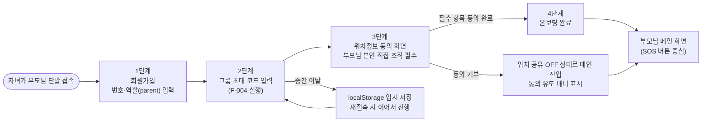
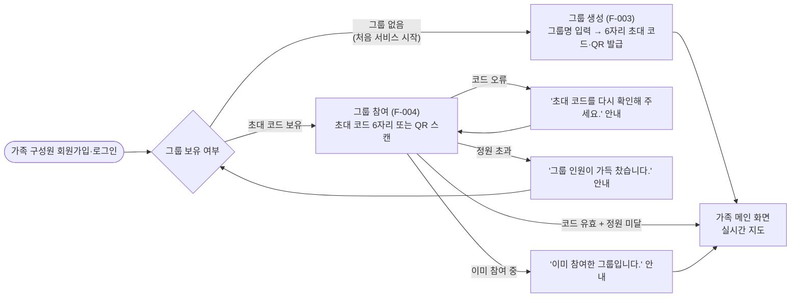
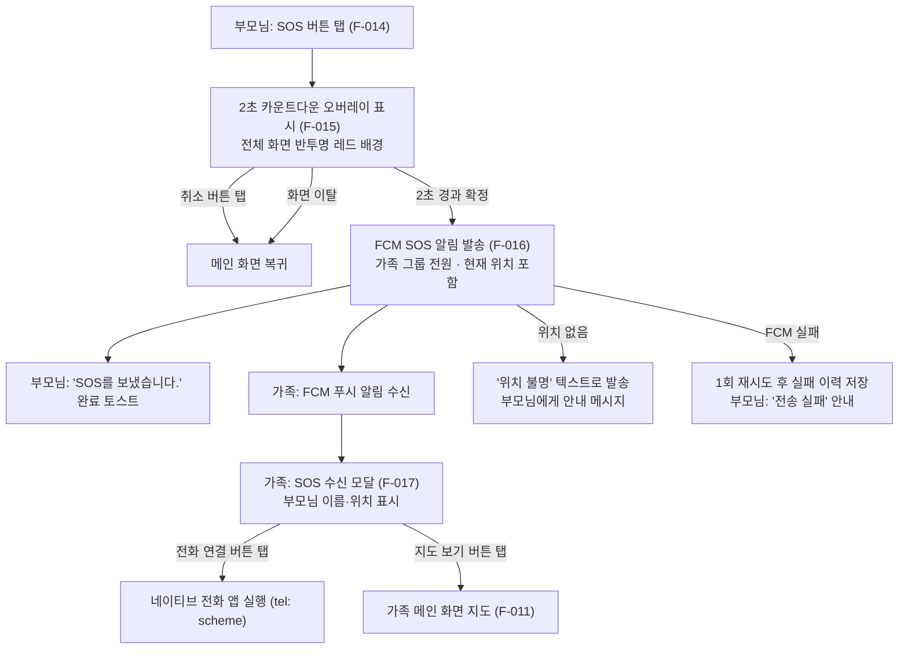
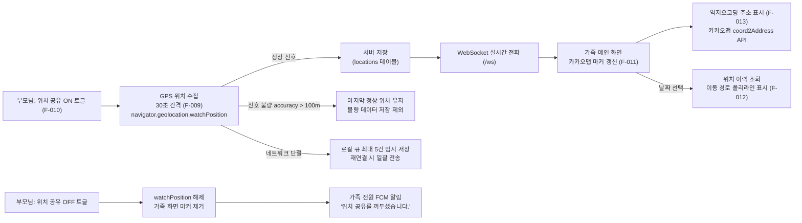
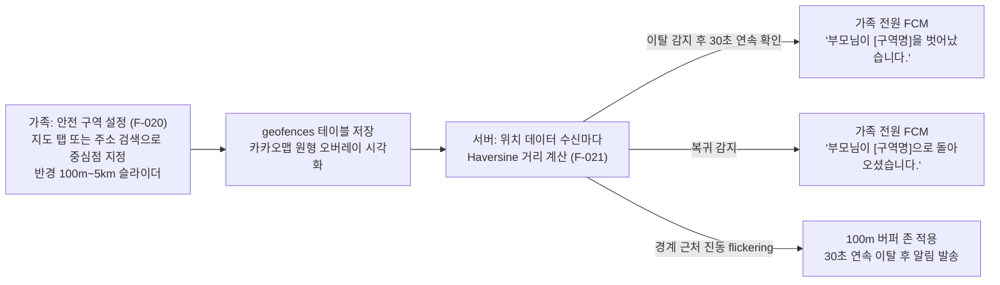

# 정보구조도 (Information Architecture)

| 항목 | 내용 |
|------|------|
| 프로젝트명 | 부모님 위치 확인 서비스 (안심맵, AnsimMap) |
| 문서 번호 | DOC-08 |
| 문서 버전 | v1.0 |
| 작성일 | 2026-05-31 |
| 최종 수정일 | 2026-05-31 |
| 작성자 | PM |
| 참조 문서 | 기능명세서.md (v1.0) |

---

## 1. 전체 사이트맵

```mermaid
flowchart TD
    Start([서비스 진입]) --> Login[로그인]
    Start --> Register[회원가입]

    Register --> |역할 선택 후 가입| Login

    Login --> |role: parent + 온보딩 미완료| OB1
    Login --> |role: parent + 온보딩 완료| ParentMain
    Login --> |role: family + 그룹 미참여| FamilyGroup
    Login --> |role: family + 그룹 참여 완료| FamilyMain
    Login --> |role: admin| AdminMain

    subgraph ParentView ["부모님 화면 (Parent View)"]
        subgraph Onboarding ["온보딩 플로우 (F-005)"]
            OB1["1단계: 번호·역할 입력 (F-001)"]
            OB2["2단계: 그룹 초대 코드 입력 (F-004)"]
            OB3["3단계: 위치정보 동의 (F-006)"]
            OB4["4단계: 완료"]
            OB1 --> OB2 --> OB3 --> OB4
        end
        ParentMain["메인 화면\nSOS 버튼 + 위치 공유 토글\n(F-009, F-010, F-014)"]
        SOSOverlay["SOS 카운트다운 오버레이\n(F-015, F-016)"]
        ParentSettings["설정 화면\n위치 동의 철회 + 배터리 모드\n(F-008, F-027)"]

        OB4 --> ParentMain
        ParentMain --> SOSOverlay
        ParentMain --> ParentSettings
    end

    subgraph FamilyView ["가족 화면 (Family View)"]
        FamilyGroup["그룹 생성·참여 선택"]
        GroupCreate["그룹 생성 화면 (F-003)"]
        GroupJoin["그룹 참여 화면 (F-004)"]
        FamilyMain["메인 화면\n실시간 지도 (F-011, F-013)"]
        LocationHistory["위치 이력 화면 (F-012)"]
        Chat["채팅방 화면 (F-018, F-019)"]
        SafeZone["안전 구역 설정 화면 (F-020, F-021)"]
        SOSReceive["SOS 수신 모달 (F-017)"]

        FamilyGroup --> GroupCreate
        FamilyGroup --> GroupJoin
        GroupCreate --> FamilyMain
        GroupJoin --> FamilyMain
        FamilyMain --> LocationHistory
        FamilyMain --> Chat
        FamilyMain --> SafeZone
        FamilyMain --> SOSReceive
    end

    subgraph AdminView ["관리자 화면 (Admin View)"]
        AdminMain["회원 목록 화면 (F-022)"]
        AdminDetail["회원 상세 화면 (F-023)"]
        AdminSMS["SMS 발송 화면 (F-024)"]
        AdminAlimtalk["알림톡 발송 화면 (F-025)"]
        AdminStats["통계 대시보드 (F-026)"]

        AdminMain --> AdminDetail
        AdminMain --> AdminSMS
        AdminMain --> AdminAlimtalk
        AdminMain --> AdminStats
    end

    Register --> Privacy[개인정보처리방침 페이지\n(F-028)]
    ParentSettings --> Privacy
```

---

## 2. 사용자 흐름 (User Flow)

### 2.1 부모님 최초 온보딩 플로우 (자녀 대리 설정)



### 2.2 가족 구성원 그룹 생성·참여 플로우



### 2.3 SOS 긴급 알림 발송·수신 플로우



### 2.4 위치 공유·실시간 지도 갱신 플로우



### 2.5 안전 구역 이탈 알림 플로우



---

## 3. 화면-기능 매핑

| 화면명 | URL 경로 | View | 주요 기능 | 관련 기능 ID |
|--------|----------|------|-----------|-------------|
| 로그인 | `/login` | 공통 | 휴대폰 번호 로그인, 역할별 라우팅, 7일 자동 로그인 | F-002 |
| 회원가입 | `/register` | 공통 | 번호 입력, 역할 선택, 개인정보·이용약관 동의 | F-001, F-007 |
| 개인정보처리방침 | `/privacy` | 공통 | 처리방침 전문 열람 (정적 페이지) | F-028 |
| 온보딩 1단계 | `/onboarding/step1` | Parent | 부모님 번호·역할(parent) 입력 | F-005, F-001 |
| 온보딩 2단계 | `/onboarding/step2` | Parent | 그룹 초대 코드 입력 | F-005, F-004 |
| 온보딩 3단계 | `/onboarding/step3` | Parent | 위치정보 수집·이용 동의 (전체 화면 단독) | F-005, F-006 |
| 온보딩 4단계 | `/onboarding/step4` | Parent | 온보딩 완료, 메인 화면 진입 안내 | F-005 |
| 부모님 메인 | `/parent` | Parent | SOS 버튼, 위치 공유 ON/OFF 토글, 공유 상태 표시 | F-009, F-010, F-014 |
| SOS 카운트다운 오버레이 | `/parent` (오버레이) | Parent | 2초 카운트다운, SOS 확정 또는 취소 | F-015, F-016 |
| 부모님 설정 | `/parent/settings` | Parent | 위치정보 동의 철회, 배터리 절약 모드 전환 | F-008, F-027 |
| 그룹 생성 | `/family/group/create` | Family | 그룹명 입력, 초대 코드·QR 코드 발급 | F-003 |
| 그룹 참여 | `/family/group/join` | Family | 초대 코드 6자리 입력 또는 QR 스캔 | F-004 |
| 가족 메인 (지도) | `/family` | Family | 실시간 카카오맵, 부모님 위치 마커, 역지오코딩 주소 | F-011, F-013 |
| 위치 이력 | `/family/history` | Family | 날짜 선택, 이동 경로 폴리라인, 시간대별 위치 목록 | F-012 |
| 채팅방 | `/family/chat` | Family | WebSocket 실시간 채팅, 미접속자 FCM 푸시 알림 | F-018, F-019 |
| 안전 구역 설정 | `/family/geofence` | Family | 구역 생성·수정·삭제, 이탈·복귀 알림 활성화 | F-020, F-021 |
| SOS 수신 모달 | `/family` (모달) | Family | SOS 발신 부모님 이름·위치 표시, 전화 연결 | F-017 |
| 관리자 회원 목록 | `/admin/groups` | Admin | 가족 그룹 목록, 검색·정렬, 페이지네이션 (20건) | F-022 |
| 관리자 회원 상세 | `/admin/groups/:id` | Admin | 그룹 구성원 목록, 마지막 접속·위치 공유 상태 | F-023 |
| 관리자 SMS 발송 | `/admin/sms` | Admin | 대상 선택, SMS·LMS 자동 분류, 발송 이력 | F-024 |
| 관리자 알림톡 발송 | `/admin/alimtalk` | Admin | 템플릿 선택, 변수 입력, 발송 이력 (성공·실패 건수) | F-025 |
| 관리자 통계 대시보드 | `/admin/stats` | Admin | DAU·SOS·그룹 수 집계, 추이 차트, CSV 내보내기 | F-026 |

---

## 4. 화면별 진입 조건

| 화면명 | 진입 조건 | 미충족 시 처리 |
|--------|-----------|---------------|
| 부모님 메인 | 로그인 완료 + role=parent + 온보딩 완료 | 온보딩 1단계로 이동 |
| 온보딩 플로우 | 로그인 완료 + role=parent + 온보딩 미완료 | 미완료 단계로 자동 이동 |
| 부모님 설정 | 로그인 완료 + role=parent | 로그인 화면으로 이동 |
| 가족 메인 (지도) | 로그인 완료 + role=family + 그룹 참여 완료 | 그룹 생성·참여 화면으로 이동 |
| 위치 이력 | 로그인 완료 + role=family + 그룹 참여 완료 | 그룹 생성·참여 화면으로 이동 |
| 채팅방 | 로그인 완료 + role=family + 그룹 참여 완료 | 그룹 생성·참여 화면으로 이동 |
| 안전 구역 설정 | 로그인 완료 + role=family + 그룹 참여 완료 | 그룹 생성·참여 화면으로 이동 |
| 관리자 화면 전체 | 로그인 완료 + role=admin | 401 반환 + 로그인 화면으로 이동 |
| SOS 카운트다운 | 부모님 메인에서 SOS 버튼 탭 | 부모님 메인에서만 진입 가능 |
| SOS 수신 모달 | FCM SOS 알림 수신 또는 가족 메인 접속 시 미확인 SOS 존재 | — |

---

## 변경 이력

| 버전 | 변경일 | 변경자 | 변경 내용 |
|------|--------|--------|-----------|
| v1.0 | 2026-05-31 | PM | 최초 작성 — 기능명세서 v1.0 기반 전체 사이트맵·사용자 흐름 5개·화면-기능 매핑·진입 조건 정의 |
