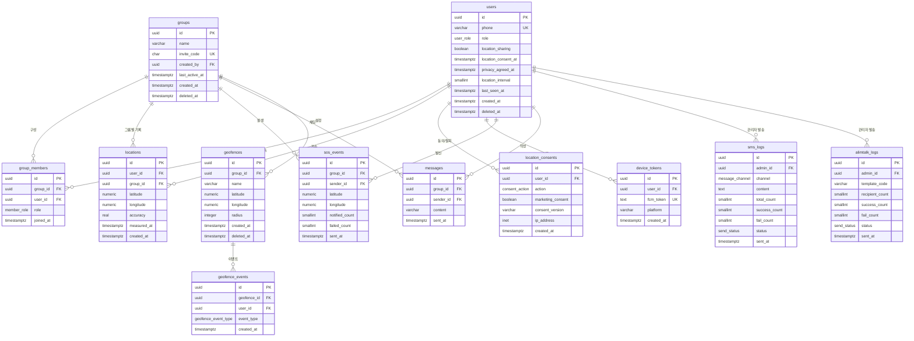

# 데이터베이스 설계서

| 항목 | 내용 |
|------|------|
| 프로젝트명 | 부모님 위치 확인 서비스 (안심맵, AnsimMap) |
| 문서 번호 | DOC-12 |
| 문서 버전 | v1.0 |
| 작성일 | 2026-06-03 |
| 최종 수정일 | 2026-06-03 |
| 작성자 | PM |
| 참조 문서 | 기능명세서.md (v1.0), API스펙.md (v1.0) |
| DBMS | PostgreSQL 15 (Supabase 호스팅) |

---

## 1. 개요

본 문서는 부모님 위치 확인 서비스(안심맵)의 데이터베이스 논리적/물리적 구조를 정의한다. 기능명세서(F-001~F-028)와 API스펙(API-001~API-029, WS-001)에서 도출한 데이터 요구사항을 기반으로 한다.

### 1.1 설계 원칙

| 원칙 | 내용 |
|------|------|
| DBMS | PostgreSQL 15 (Supabase). Vercel Lambda(IPv4)에서는 REST API의 RPC 함수로 SQL 실행 |
| 기본 키 | `UUID` (`gen_random_uuid()`) 사용. API 응답에서 식별자를 `uuid-xxxx` 형식으로 노출 |
| 명명 규칙 | 테이블·컬럼은 `snake_case`, 테이블명은 복수형(`users`, `groups`) |
| 시간 컬럼 | `TIMESTAMPTZ` (UTC 저장, ISO 8601 응답). 모든 테이블에 `created_at` 기본 |
| 위치 정밀도 | 위도·경도는 `NUMERIC(10,7)` (소수점 7자리, 약 1cm 정밀도) |
| 삭제 정책 | 회원·그룹은 소프트 삭제(`deleted_at`), 위치 이력은 7일 후 하드 삭제 |
| 위치정보법 준수 | 동의 이력(`location_consents`)을 별도 테이블에 불변 기록으로 보관 |

### 1.2 ENUM 타입 정의

| ENUM 타입 | 값 | 사용 테이블 |
|-----------|-----|------------|
| `user_role` | `parent`, `family`, `admin` | users |
| `member_role` | `owner`, `member` | group_members |
| `consent_action` | `grant`, `revoke` | location_consents |
| `geofence_event_type` | `exit`, `enter` | geofence_events |
| `message_channel` | `sms`, `lms` | sms_logs |
| `send_status` | `success`, `fail`, `partial` | sms_logs, alimtalk_logs |

---

## 2. ERD (Entity-Relationship Diagram)



---

## 3. 테이블 정의

### 3.1 users (회원)

회원 계정 정보. 휴대폰 번호 기반 가입, 역할(부모님/가족/관리자) 구분. 관련 기능: F-001, F-002, F-006, F-008, F-010, F-027.

| 컬럼명 | 타입 | 제약조건 | 기본값 | 설명 |
|--------|------|----------|--------|------|
| id | UUID | PK | gen_random_uuid() | 사용자 고유 ID |
| phone | VARCHAR(11) | UNIQUE, NOT NULL | - | 휴대폰 번호 (숫자 11자리) |
| role | user_role | NOT NULL | - | 역할 (parent / family / admin) |
| location_sharing | BOOLEAN | NOT NULL | false | 위치 공유 ON/OFF 상태 (F-010) |
| location_consent_at | TIMESTAMPTZ | NULL | NULL | 위치정보 수집 동의 일시 (철회 시 NULL) |
| privacy_agreed_at | TIMESTAMPTZ | NULL | NULL | 개인정보처리방침 동의 일시 (F-007) |
| terms_agreed_at | TIMESTAMPTZ | NULL | NULL | 서비스 이용약관 동의 일시 |
| location_interval | SMALLINT | NOT NULL | 30 | 위치 전송 주기 (초, 30 또는 180) (F-027) |
| last_seen_at | TIMESTAMPTZ | NULL | NULL | 마지막 접속 일시 (DAU 집계·관리자 조회) |
| created_at | TIMESTAMPTZ | NOT NULL | now() | 가입 일시 |
| updated_at | TIMESTAMPTZ | NOT NULL | now() | 수정 일시 |
| deleted_at | TIMESTAMPTZ | NULL | NULL | 탈퇴 일시 (소프트 삭제) |

### 3.2 groups (가족 그룹)

가족 그룹 단위. 6자리 초대 코드로 참여. 관련 기능: F-003, F-004, F-022.

| 컬럼명 | 타입 | 제약조건 | 기본값 | 설명 |
|--------|------|----------|--------|------|
| id | UUID | PK | gen_random_uuid() | 그룹 고유 ID |
| name | VARCHAR(20) | NOT NULL | - | 그룹명 (1~20자) |
| invite_code | CHAR(6) | UNIQUE, NOT NULL | - | 6자리 영숫자 초대 코드 |
| created_by | UUID | FK(users.id), NOT NULL | - | 그룹 생성자 (owner) |
| plan | VARCHAR(10) | NOT NULL | 'free' | 요금제 (free / pro) — 정원·안전구역 한도 결정 |
| max_members | SMALLINT | NOT NULL | 5 | 최대 구성원 수 (Free 5명) |
| last_active_at | TIMESTAMPTZ | NULL | NULL | 마지막 활동 일시 (관리자 정렬 기준) |
| created_at | TIMESTAMPTZ | NOT NULL | now() | 생성 일시 |
| deleted_at | TIMESTAMPTZ | NULL | NULL | 삭제 일시 (소프트 삭제) |

### 3.3 group_members (그룹 구성원)

users와 groups의 N:M 매핑. 그룹 내 역할(owner/member) 구분. 관련 기능: F-003, F-004, F-016, F-023.

| 컬럼명 | 타입 | 제약조건 | 기본값 | 설명 |
|--------|------|----------|--------|------|
| id | UUID | PK | gen_random_uuid() | 매핑 고유 ID |
| group_id | UUID | FK(groups.id), NOT NULL | - | 그룹 ID |
| user_id | UUID | FK(users.id), NOT NULL | - | 사용자 ID |
| role | member_role | NOT NULL | 'member' | 그룹 내 역할 (owner / member) |
| joined_at | TIMESTAMPTZ | NOT NULL | now() | 참여 일시 |

> 제약: `UNIQUE(group_id, user_id)` — 동일 그룹 중복 참여 방지 (F-004 "이미 참여한 그룹" 검증).

### 3.4 locations (위치 이력)

부모님 단말기의 GPS 위치 기록. 30초 간격 저장, 7일 후 자동 삭제. 관련 기능: F-009, F-011, F-012.

| 컬럼명 | 타입 | 제약조건 | 기본값 | 설명 |
|--------|------|----------|--------|------|
| id | UUID | PK | gen_random_uuid() | 위치 기록 ID |
| user_id | UUID | FK(users.id), NOT NULL | - | 위치 전송자 (부모님) |
| group_id | UUID | FK(groups.id), NOT NULL | - | 소속 그룹 (그룹별 조회 최적화) |
| latitude | NUMERIC(10,7) | NOT NULL | - | 위도 (소수점 7자리) |
| longitude | NUMERIC(10,7) | NOT NULL | - | 경도 (소수점 7자리) |
| accuracy | REAL | NOT NULL | - | 정확도 (미터, 100 초과 시 저장 제외) |
| measured_at | TIMESTAMPTZ | NOT NULL | - | 단말기 측정 시각 (클라이언트 timestamp) |
| created_at | TIMESTAMPTZ | NOT NULL | now() | 서버 저장 시각 |

> 보존 정책: `measured_at < now() - INTERVAL '7 days'` 데이터는 일일 배치(pg_cron)로 하드 삭제 (F-009).

### 3.5 location_consents (위치정보 동의 이력)

위치정보법 제15조 준수를 위한 동의/철회 불변 이력. 관련 기능: F-006, F-008.

| 컬럼명 | 타입 | 제약조건 | 기본값 | 설명 |
|--------|------|----------|--------|------|
| id | UUID | PK | gen_random_uuid() | 동의 이력 ID |
| user_id | UUID | FK(users.id), NOT NULL | - | 동의 주체 (부모님) |
| action | consent_action | NOT NULL | - | grant(동의) / revoke(철회) |
| location_consent_required | BOOLEAN | NOT NULL | - | 위치정보 수집·이용 필수 동의 여부 |
| marketing_consent | BOOLEAN | NOT NULL | false | 마케팅 활용 선택 동의 여부 |
| consent_version | VARCHAR(10) | NOT NULL | - | 동의 약관 버전 (예: v1.0) |
| ip_address | INET | NULL | NULL | 동의 시점 IP 주소 (법적 증빙) |
| created_at | TIMESTAMPTZ | NOT NULL | now() | 동의/철회 일시 |

> 본 테이블은 UPDATE/DELETE 하지 않고 INSERT만 수행 (감사 추적 보장).

### 3.6 device_tokens (FCM 디바이스 토큰)

FCM 푸시 발송 대상 토큰. 만료 토큰은 삭제. 관련 기능: F-016, F-019, F-021.

| 컬럼명 | 타입 | 제약조건 | 기본값 | 설명 |
|--------|------|----------|--------|------|
| id | UUID | PK | gen_random_uuid() | 토큰 레코드 ID |
| user_id | UUID | FK(users.id), NOT NULL | - | 토큰 소유자 |
| fcm_token | TEXT | UNIQUE, NOT NULL | - | FCM 디바이스 토큰 |
| platform | VARCHAR(10) | NOT NULL | 'web' | 플랫폼 (web / ios / android) |
| created_at | TIMESTAMPTZ | NOT NULL | now() | 등록 일시 |
| updated_at | TIMESTAMPTZ | NOT NULL | now() | 갱신 일시 |

> 발송 실패(토큰 만료) 시 해당 레코드 삭제 (F-016 예외 처리).

### 3.7 sos_events (SOS 발송 이력)

SOS 긴급 알림 발송 기록. 관련 기능: F-016, F-017, F-026.

| 컬럼명 | 타입 | 제약조건 | 기본값 | 설명 |
|--------|------|----------|--------|------|
| id | UUID | PK | gen_random_uuid() | SOS 이벤트 ID |
| group_id | UUID | FK(groups.id), NOT NULL | - | 발생 그룹 |
| sender_id | UUID | FK(users.id), NOT NULL | - | 발신자 (부모님) |
| latitude | NUMERIC(10,7) | NULL | NULL | 발신 시 위도 (위치 불명 시 NULL) |
| longitude | NUMERIC(10,7) | NULL | NULL | 발신 시 경도 |
| notified_count | SMALLINT | NOT NULL | 0 | FCM 발송 성공 건수 |
| failed_count | SMALLINT | NOT NULL | 0 | FCM 발송 실패 건수 |
| sent_at | TIMESTAMPTZ | NOT NULL | now() | 발송 일시 |

### 3.8 messages (채팅 메시지)

가족 그룹 채팅 메시지. 관련 기능: F-018, F-019.

| 컬럼명 | 타입 | 제약조건 | 기본값 | 설명 |
|--------|------|----------|--------|------|
| id | UUID | PK | gen_random_uuid() | 메시지 ID |
| group_id | UUID | FK(groups.id), NOT NULL | - | 채팅방(그룹) ID |
| sender_id | UUID | FK(users.id), NOT NULL | - | 발신자 |
| content | VARCHAR(500) | NOT NULL | - | 메시지 내용 (1~500자) |
| sent_at | TIMESTAMPTZ | NOT NULL | now() | 전송 일시 (커서 페이지네이션 기준) |

### 3.9 geofences (안전 구역)

지오펜싱 안전 구역. Free 1개 / Pro 2개 한도. 관련 기능: F-020, F-021.

| 컬럼명 | 타입 | 제약조건 | 기본값 | 설명 |
|--------|------|----------|--------|------|
| id | UUID | PK | gen_random_uuid() | 안전 구역 ID |
| group_id | UUID | FK(groups.id), NOT NULL | - | 소속 그룹 |
| name | VARCHAR(20) | NOT NULL | - | 구역명 (1~20자) |
| latitude | NUMERIC(10,7) | NOT NULL | - | 중심점 위도 |
| longitude | NUMERIC(10,7) | NOT NULL | - | 중심점 경도 |
| radius | INTEGER | NOT NULL | - | 반경 (미터, 100~5000) |
| created_at | TIMESTAMPTZ | NOT NULL | now() | 생성 일시 |
| updated_at | TIMESTAMPTZ | NOT NULL | now() | 수정 일시 |
| deleted_at | TIMESTAMPTZ | NULL | NULL | 삭제 일시 (소프트 삭제) |

> 제약: `CHECK (radius BETWEEN 100 AND 5000)` (API-019 범위 검증).

### 3.10 geofence_events (안전 구역 이탈/복귀 이력)

안전 구역 이탈·복귀 이벤트 이력. 관련 기능: F-021.

| 컬럼명 | 타입 | 제약조건 | 기본값 | 설명 |
|--------|------|----------|--------|------|
| id | UUID | PK | gen_random_uuid() | 이벤트 ID |
| geofence_id | UUID | FK(geofences.id), NOT NULL | - | 대상 안전 구역 |
| user_id | UUID | FK(users.id), NOT NULL | - | 대상 사용자 (부모님) |
| event_type | geofence_event_type | NOT NULL | - | exit(이탈) / enter(복귀) |
| latitude | NUMERIC(10,7) | NULL | NULL | 이벤트 발생 위도 |
| longitude | NUMERIC(10,7) | NULL | NULL | 이벤트 발생 경도 |
| created_at | TIMESTAMPTZ | NOT NULL | now() | 이벤트 발생 일시 |

### 3.11 sms_logs (SMS 발송 이력)

관리자 NHN Cloud SMS 발송 이력. 관련 기능: F-024.

| 컬럼명 | 타입 | 제약조건 | 기본값 | 설명 |
|--------|------|----------|--------|------|
| id | UUID | PK | gen_random_uuid() | 발송 로그 ID |
| admin_id | UUID | FK(users.id), NOT NULL | - | 발송 관리자 |
| channel | message_channel | NOT NULL | - | sms(90자 이하) / lms(91자 이상) |
| content | TEXT | NOT NULL | - | 발송 내용 (최대 2000자) |
| recipients | JSONB | NOT NULL | - | 수신 번호 배열 |
| total_count | SMALLINT | NOT NULL | 0 | 총 발송 건수 |
| success_count | SMALLINT | NOT NULL | 0 | 성공 건수 |
| fail_count | SMALLINT | NOT NULL | 0 | 실패 건수 |
| status | send_status | NOT NULL | - | success / fail / partial |
| sent_at | TIMESTAMPTZ | NOT NULL | now() | 발송 일시 |

### 3.12 alimtalk_logs (카카오 알림톡 발송 이력)

관리자 카카오 알림톡 발송 이력. 관련 기능: F-025.

| 컬럼명 | 타입 | 제약조건 | 기본값 | 설명 |
|--------|------|----------|--------|------|
| id | UUID | PK | gen_random_uuid() | 발송 로그 ID |
| admin_id | UUID | FK(users.id), NOT NULL | - | 발송 관리자 |
| template_code | VARCHAR(50) | NOT NULL | - | 알림톡 템플릿 코드 |
| variables | JSONB | NULL | NULL | 템플릿 변수 키-값 |
| recipient_count | SMALLINT | NOT NULL | 0 | 수신 대상 건수 |
| success_count | SMALLINT | NOT NULL | 0 | 성공 건수 |
| fail_count | SMALLINT | NOT NULL | 0 | 실패 건수 |
| status | send_status | NOT NULL | - | success / fail / partial |
| sent_at | TIMESTAMPTZ | NOT NULL | now() | 발송 일시 |

---

## 4. 인덱스 정의

| 테이블 | 인덱스명 | 컬럼 | 유형 | 목적 |
|--------|----------|------|------|------|
| users | idx_users_phone | phone | UNIQUE | 로그인·중복 가입 조회 (F-001, F-002) |
| users | idx_users_role | role | B-Tree | 관리자 권한 확인, DAU 집계 |
| groups | idx_groups_invite_code | invite_code | UNIQUE | 초대 코드 그룹 조회 (F-004) |
| groups | idx_groups_created_by | created_by | B-Tree | 생성자 기준 조회 |
| group_members | uq_group_members | (group_id, user_id) | UNIQUE | 중복 참여 방지 (F-004) |
| group_members | idx_gm_user_id | user_id | B-Tree | 내 소속 그룹 조회 (F-002 /me) |
| locations | idx_loc_group_measured | (group_id, measured_at DESC) | B-Tree | 현재·이력 위치 조회 (F-011, F-012) |
| locations | idx_loc_measured_at | measured_at | B-Tree | 7일 만료 배치 삭제 (F-009) |
| location_consents | idx_consent_user | (user_id, created_at DESC) | B-Tree | 동의 이력 최신순 조회 (F-008) |
| device_tokens | idx_token_user | user_id | B-Tree | 그룹 구성원 토큰 일괄 조회 (F-016) |
| device_tokens | uq_token_fcm | fcm_token | UNIQUE | 토큰 중복 방지 |
| sos_events | idx_sos_group_sent | (group_id, sent_at DESC) | B-Tree | SOS 이력 최신순 조회 (F-017) |
| messages | idx_msg_group_sent | (group_id, sent_at DESC) | B-Tree | 채팅 커서 페이지네이션 (F-018) |
| geofences | idx_geo_group | group_id | B-Tree | 그룹 안전 구역 목록 조회 (F-021) |
| geofence_events | idx_geoevt_geofence | (geofence_id, created_at DESC) | B-Tree | 이탈/복귀 이력 조회 |
| sms_logs | idx_sms_sent | sent_at DESC | B-Tree | 발송 이력 최신순 조회 (F-024) |
| alimtalk_logs | idx_alimtalk_sent | sent_at DESC | B-Tree | 알림톡 이력 페이지네이션 (F-025) |

---

## 5. 관계 정의

| 부모 테이블 | 자식 테이블 | 관계 | FK 컬럼 | ON DELETE | 설명 |
|-------------|-------------|------|---------|-----------|------|
| users | groups | 1:N | created_by | RESTRICT | 사용자가 여러 그룹 생성 가능 |
| users | group_members | 1:N | user_id | CASCADE | 탈퇴 시 그룹 멤버십 삭제 |
| groups | group_members | 1:N | group_id | CASCADE | 그룹 삭제 시 멤버십 삭제 |
| users | locations | 1:N | user_id | CASCADE | 사용자별 위치 이력 |
| groups | locations | 1:N | group_id | CASCADE | 그룹별 위치 이력 |
| users | location_consents | 1:N | user_id | CASCADE | 동의/철회 이력 |
| users | device_tokens | 1:N | user_id | CASCADE | 사용자별 FCM 토큰 |
| groups | sos_events | 1:N | group_id | CASCADE | 그룹별 SOS 이력 |
| users | sos_events | 1:N | sender_id | CASCADE | 발신자별 SOS 이력 |
| groups | messages | 1:N | group_id | CASCADE | 그룹별 채팅 |
| users | messages | 1:N | sender_id | CASCADE | 발신자별 채팅 |
| groups | geofences | 1:N | group_id | CASCADE | 그룹별 안전 구역 |
| geofences | geofence_events | 1:N | geofence_id | CASCADE | 구역별 이벤트 이력 |
| users | sms_logs | 1:N | admin_id | RESTRICT | 관리자 발송 이력 |
| users | alimtalk_logs | 1:N | admin_id | RESTRICT | 관리자 발송 이력 |

---

## 6. DDL (PostgreSQL)

```sql
-- ENUM 타입
CREATE TYPE user_role AS ENUM ('parent', 'family', 'admin');
CREATE TYPE member_role AS ENUM ('owner', 'member');
CREATE TYPE consent_action AS ENUM ('grant', 'revoke');
CREATE TYPE geofence_event_type AS ENUM ('exit', 'enter');
CREATE TYPE message_channel AS ENUM ('sms', 'lms');
CREATE TYPE send_status AS ENUM ('success', 'fail', 'partial');

-- users
CREATE TABLE users (
    id                  UUID PRIMARY KEY DEFAULT gen_random_uuid(),
    phone               VARCHAR(11) UNIQUE NOT NULL,
    role                user_role NOT NULL,
    location_sharing    BOOLEAN NOT NULL DEFAULT false,
    location_consent_at TIMESTAMPTZ,
    privacy_agreed_at   TIMESTAMPTZ,
    terms_agreed_at     TIMESTAMPTZ,
    location_interval   SMALLINT NOT NULL DEFAULT 30 CHECK (location_interval IN (30, 180)),
    last_seen_at        TIMESTAMPTZ,
    created_at          TIMESTAMPTZ NOT NULL DEFAULT now(),
    updated_at          TIMESTAMPTZ NOT NULL DEFAULT now(),
    deleted_at          TIMESTAMPTZ
);
CREATE INDEX idx_users_role ON users(role);

-- groups
CREATE TABLE groups (
    id              UUID PRIMARY KEY DEFAULT gen_random_uuid(),
    name            VARCHAR(20) NOT NULL,
    invite_code     CHAR(6) UNIQUE NOT NULL,
    created_by      UUID NOT NULL REFERENCES users(id) ON DELETE RESTRICT,
    plan            VARCHAR(10) NOT NULL DEFAULT 'free',
    max_members     SMALLINT NOT NULL DEFAULT 5,
    last_active_at  TIMESTAMPTZ,
    created_at      TIMESTAMPTZ NOT NULL DEFAULT now(),
    deleted_at      TIMESTAMPTZ
);
CREATE INDEX idx_groups_created_by ON groups(created_by);

-- group_members
CREATE TABLE group_members (
    id          UUID PRIMARY KEY DEFAULT gen_random_uuid(),
    group_id    UUID NOT NULL REFERENCES groups(id) ON DELETE CASCADE,
    user_id     UUID NOT NULL REFERENCES users(id) ON DELETE CASCADE,
    role        member_role NOT NULL DEFAULT 'member',
    joined_at   TIMESTAMPTZ NOT NULL DEFAULT now(),
    UNIQUE (group_id, user_id)
);
CREATE INDEX idx_gm_user_id ON group_members(user_id);

-- locations
CREATE TABLE locations (
    id          UUID PRIMARY KEY DEFAULT gen_random_uuid(),
    user_id     UUID NOT NULL REFERENCES users(id) ON DELETE CASCADE,
    group_id    UUID NOT NULL REFERENCES groups(id) ON DELETE CASCADE,
    latitude    NUMERIC(10,7) NOT NULL,
    longitude   NUMERIC(10,7) NOT NULL,
    accuracy    REAL NOT NULL CHECK (accuracy <= 100),
    measured_at TIMESTAMPTZ NOT NULL,
    created_at  TIMESTAMPTZ NOT NULL DEFAULT now()
);
CREATE INDEX idx_loc_group_measured ON locations(group_id, measured_at DESC);
CREATE INDEX idx_loc_measured_at ON locations(measured_at);

-- location_consents
CREATE TABLE location_consents (
    id                        UUID PRIMARY KEY DEFAULT gen_random_uuid(),
    user_id                   UUID NOT NULL REFERENCES users(id) ON DELETE CASCADE,
    action                    consent_action NOT NULL,
    location_consent_required BOOLEAN NOT NULL,
    marketing_consent         BOOLEAN NOT NULL DEFAULT false,
    consent_version           VARCHAR(10) NOT NULL,
    ip_address                INET,
    created_at                TIMESTAMPTZ NOT NULL DEFAULT now()
);
CREATE INDEX idx_consent_user ON location_consents(user_id, created_at DESC);

-- device_tokens
CREATE TABLE device_tokens (
    id          UUID PRIMARY KEY DEFAULT gen_random_uuid(),
    user_id     UUID NOT NULL REFERENCES users(id) ON DELETE CASCADE,
    fcm_token   TEXT UNIQUE NOT NULL,
    platform    VARCHAR(10) NOT NULL DEFAULT 'web',
    created_at  TIMESTAMPTZ NOT NULL DEFAULT now(),
    updated_at  TIMESTAMPTZ NOT NULL DEFAULT now()
);
CREATE INDEX idx_token_user ON device_tokens(user_id);

-- sos_events
CREATE TABLE sos_events (
    id              UUID PRIMARY KEY DEFAULT gen_random_uuid(),
    group_id        UUID NOT NULL REFERENCES groups(id) ON DELETE CASCADE,
    sender_id       UUID NOT NULL REFERENCES users(id) ON DELETE CASCADE,
    latitude        NUMERIC(10,7),
    longitude       NUMERIC(10,7),
    notified_count  SMALLINT NOT NULL DEFAULT 0,
    failed_count    SMALLINT NOT NULL DEFAULT 0,
    sent_at         TIMESTAMPTZ NOT NULL DEFAULT now()
);
CREATE INDEX idx_sos_group_sent ON sos_events(group_id, sent_at DESC);

-- messages
CREATE TABLE messages (
    id          UUID PRIMARY KEY DEFAULT gen_random_uuid(),
    group_id    UUID NOT NULL REFERENCES groups(id) ON DELETE CASCADE,
    sender_id   UUID NOT NULL REFERENCES users(id) ON DELETE CASCADE,
    content     VARCHAR(500) NOT NULL,
    sent_at     TIMESTAMPTZ NOT NULL DEFAULT now()
);
CREATE INDEX idx_msg_group_sent ON messages(group_id, sent_at DESC);

-- geofences
CREATE TABLE geofences (
    id          UUID PRIMARY KEY DEFAULT gen_random_uuid(),
    group_id    UUID NOT NULL REFERENCES groups(id) ON DELETE CASCADE,
    name        VARCHAR(20) NOT NULL,
    latitude    NUMERIC(10,7) NOT NULL,
    longitude   NUMERIC(10,7) NOT NULL,
    radius      INTEGER NOT NULL CHECK (radius BETWEEN 100 AND 5000),
    created_at  TIMESTAMPTZ NOT NULL DEFAULT now(),
    updated_at  TIMESTAMPTZ NOT NULL DEFAULT now(),
    deleted_at  TIMESTAMPTZ
);
CREATE INDEX idx_geo_group ON geofences(group_id);

-- geofence_events
CREATE TABLE geofence_events (
    id          UUID PRIMARY KEY DEFAULT gen_random_uuid(),
    geofence_id UUID NOT NULL REFERENCES geofences(id) ON DELETE CASCADE,
    user_id     UUID NOT NULL REFERENCES users(id) ON DELETE CASCADE,
    event_type  geofence_event_type NOT NULL,
    latitude    NUMERIC(10,7),
    longitude   NUMERIC(10,7),
    created_at  TIMESTAMPTZ NOT NULL DEFAULT now()
);
CREATE INDEX idx_geoevt_geofence ON geofence_events(geofence_id, created_at DESC);

-- sms_logs
CREATE TABLE sms_logs (
    id              UUID PRIMARY KEY DEFAULT gen_random_uuid(),
    admin_id        UUID NOT NULL REFERENCES users(id) ON DELETE RESTRICT,
    channel         message_channel NOT NULL,
    content         TEXT NOT NULL,
    recipients      JSONB NOT NULL,
    total_count     SMALLINT NOT NULL DEFAULT 0,
    success_count   SMALLINT NOT NULL DEFAULT 0,
    fail_count      SMALLINT NOT NULL DEFAULT 0,
    status          send_status NOT NULL,
    sent_at         TIMESTAMPTZ NOT NULL DEFAULT now()
);
CREATE INDEX idx_sms_sent ON sms_logs(sent_at DESC);

-- alimtalk_logs
CREATE TABLE alimtalk_logs (
    id              UUID PRIMARY KEY DEFAULT gen_random_uuid(),
    admin_id        UUID NOT NULL REFERENCES users(id) ON DELETE RESTRICT,
    template_code   VARCHAR(50) NOT NULL,
    variables       JSONB,
    recipient_count SMALLINT NOT NULL DEFAULT 0,
    success_count   SMALLINT NOT NULL DEFAULT 0,
    fail_count      SMALLINT NOT NULL DEFAULT 0,
    status          send_status NOT NULL,
    sent_at         TIMESTAMPTZ NOT NULL DEFAULT now()
);
CREATE INDEX idx_alimtalk_sent ON alimtalk_logs(sent_at DESC);
```

---

## 7. 위치 이력 보존 배치 (7일 만료)

기능명세서 F-009 및 도메인 용어 "위치 이력(최대 7일 보관)"에 따라, Supabase `pg_cron` 확장으로 일일 삭제 배치를 등록한다.

```sql
-- pg_cron 확장 활성화 (Supabase 대시보드에서 1회)
CREATE EXTENSION IF NOT EXISTS pg_cron;

-- 매일 03:00 (UTC) 7일 초과 위치 이력 삭제
SELECT cron.schedule(
    'purge-old-locations',
    '0 3 * * *',
    $$ DELETE FROM locations WHERE measured_at < now() - INTERVAL '7 days'; $$
);
```

---

## 8. Row Level Security (RLS) 정책

Supabase 환경에서 그룹 단위 데이터 격리를 위해 RLS를 적용한다. 핵심 정책 요약(예시).

| 테이블 | 정책 | 규칙 |
|--------|------|------|
| locations | 그룹 구성원만 조회 | `group_id IN (SELECT group_id FROM group_members WHERE user_id = auth.uid())` |
| messages | 그룹 구성원만 조회·작성 | 위와 동일 |
| sos_events | 그룹 구성원만 조회 | 위와 동일 |
| geofences | 그룹 구성원만 조회·수정 | 위와 동일 |
| sms_logs / alimtalk_logs | 관리자만 접근 | `(SELECT role FROM users WHERE id = auth.uid()) = 'admin'` |

> 위치 데이터 INSERT는 `role = 'parent'` 및 `location_consent_at IS NOT NULL` 조건을 서버(Route Handler)에서 추가 검증한다 (API-010 403 처리).

---

## 9. 초기 데이터 (Seed)

| 테이블 | 데이터 | 용도 |
|--------|--------|------|
| users | 관리자 계정 1건 (role=`admin`, phone=`01000000000`) | 관리자 화면 최초 접근 (F-022~F-026) |
| users | 테스트 부모님 1건 (role=`parent`), 테스트 가족 2건 (role=`family`) | 개발·QA용 그룹 시나리오 |
| groups | 테스트 그룹 "우리 가족" (invite_code=`TEST01`) | 위치 공유·채팅·SOS 통합 테스트 |
| group_members | 위 부모님(owner는 가족), 가족 2명 매핑 | 그룹 정원·권한 테스트 |
| geofences | 테스트 안전 구역 "자택" (radius=200) | 지오펜싱 이탈/복귀 테스트 (F-021) |

> 운영 배포 시 관리자 계정을 제외한 테스트 데이터는 마이그레이션에서 제외한다.

---

## 10. 기능-테이블 매핑

| F-ID | 기능 | 주요 테이블 | 관련 API |
|------|------|-------------|----------|
| F-001/002 | 회원가입/로그인 | users | API-001~004 |
| F-003/004 | 그룹 생성/참여 | groups, group_members | API-005~007 |
| F-006/008 | 위치정보 동의/철회 | location_consents, users | API-008, 009 |
| F-009 | 실시간 위치 전송 | locations | API-010 |
| F-010 | 위치 공유 토글 | users | API-011 |
| F-011/012 | 현재 위치/이력 | locations | API-012, 013 |
| F-016/017 | SOS 발송/수신 | sos_events, device_tokens | API-015, 016 |
| F-018/019 | 채팅/푸시 | messages, device_tokens | API-017, 018 |
| F-020/021 | 안전 구역/이탈 | geofences, geofence_events | API-019~022 |
| F-022/023 | 관리자 회원 조회 | groups, group_members, users | API-023, 024 |
| F-024 | SMS 발송 | sms_logs | API-025 |
| F-025 | 알림톡 발송 | alimtalk_logs | API-026, 027 |
| F-026 | 통계 대시보드 | users, groups, sos_events | API-028 |
| F-027 | 배터리 절약 모드 | users (location_interval) | API-029 |

---

## 변경 이력

| 버전 | 변경일 | 변경자 | 변경 내용 |
|------|--------|--------|-----------|
| v1.0 | 2026-06-03 | PM | 최초 작성 — 기능명세서 v1.0, API스펙 v1.0 기반 13개 테이블·인덱스·관계·DDL 정의 |
