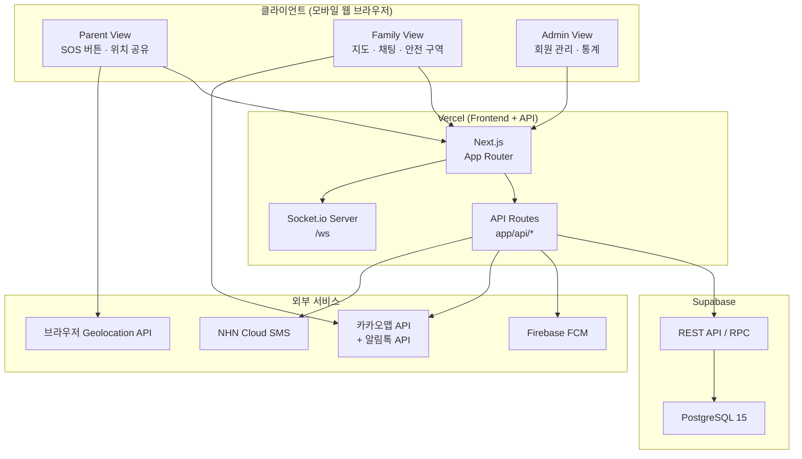
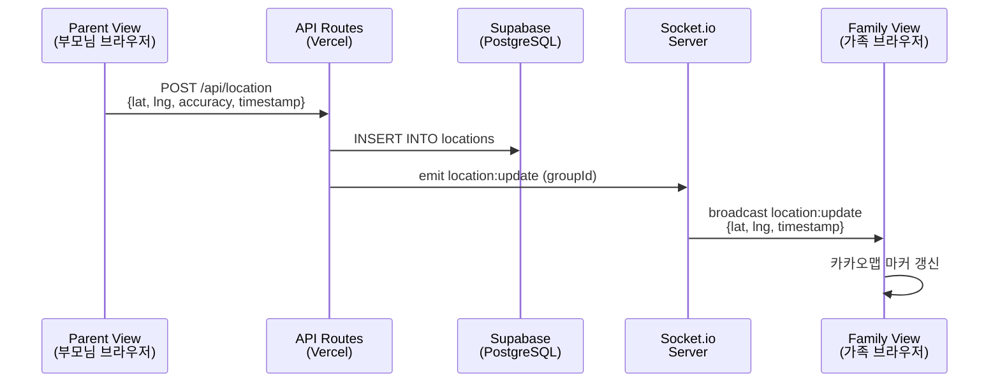
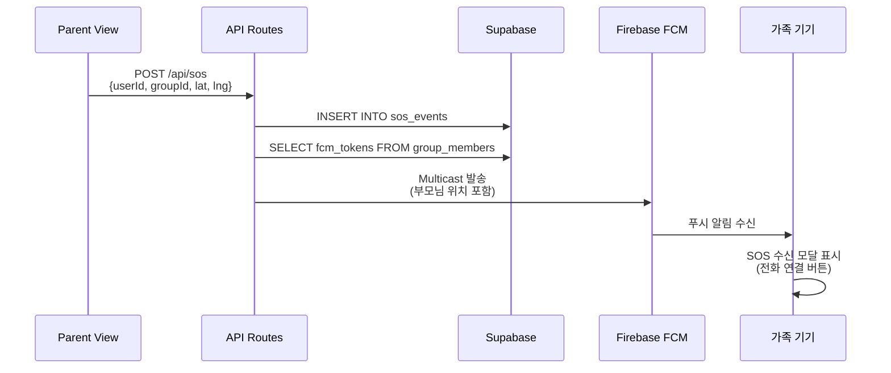

# 시스템정의서

| 항목 | 내용 |
|------|------|
| 프로젝트명 | 부모님 위치 확인 서비스 (안심맵, AnsimMap) |
| 문서 번호 | DOC-11 |
| 문서 버전 | v1.0 |
| 작성일 | 2026-05-31 |
| 최종 수정일 | 2026-05-31 |
| 작성자 | PM |
| 참조 문서 | 기능명세서.md (v1.0) |

---

## 목차

1. [시스템 개요](#1-시스템-개요)
2. [기술 스택](#2-기술-스택)
3. [시스템 아키텍처](#3-시스템-아키텍처)
4. [모듈 구성](#4-모듈-구성)
5. [디렉토리 구조](#5-디렉토리-구조)
6. [외부 서비스 연동](#6-외부-서비스-연동)
7. [환경변수 정의](#7-환경변수-정의)
8. [API 설계 규약](#8-api-설계-규약)
9. [에러 처리 규약](#9-에러-처리-규약)
10. [인증·보안 규약](#10-인증보안-규약)
11. [실시간 통신 규약](#11-실시간-통신-규약)
12. [코딩 컨벤션](#12-코딩-컨벤션)
13. [성능 목표](#13-성능-목표)
14. [변경 이력](#14-변경-이력)

---

## 1. 시스템 개요

### 1.1 서비스 설명

안심맵(AnsimMap)은 고령 부모님의 GPS 위치를 가족이 실시간으로 확인하고, 긴급 상황 시 SOS 알림을 수신할 수 있는 시니어 케어 반응형 웹 서비스이다. 별도 앱 설치 없이 모바일 웹 브라우저에서 동작하며, 부모님(Parent View) · 가족 구성원(Family View) · 관리자(Admin View) 세 가지 역할 기반 화면으로 구성된다.

### 1.2 사용자 역할

| 역할 | 설명 | 주요 기능 |
|------|------|-----------|
| parent | 위치를 공유하는 시니어(부모님) | SOS 버튼, 위치 공유 ON/OFF, 배터리 절약 모드 |
| family | 위치를 확인하는 가족 구성원(자녀·배우자) | 실시간 지도, 위치 이력, 채팅, 안전 구역 설정 |
| admin | 서비스 운영자 | 회원 관리, SMS/알림톡 발송, 통계 조회 |

### 1.3 시스템 운영 방식

- 플랫폼: 반응형 웹 (PWA 지원)
- 배포 환경: Vercel (Frontend + API Routes 통합)
- 데이터베이스: Supabase (PostgreSQL)
- 마일스톤 M1~M4 기준 Next.js API Routes를 백엔드로 사용하며, M5 이후 트래픽 증가 시 Express.js 분리를 검토한다.

---

## 2. 기술 스택

> AP-Framework V0.42 표준 스택을 기준으로 한다. 변경 시 PRD.md의 기술 스택 항목과 본 표를 함께 갱신한다.

| 영역 | 기술 | 버전 | 비고 |
|------|------|------|------|
| Frontend | Next.js | 14.x (App Router) | V0.42 표준 |
| CSS | Tailwind CSS | 3.x | V0.42 표준 |
| Backend (M1~M4) | Next.js API Routes | - | `src/frontend/app/api/*` |
| Backend (M5+) | Express.js | 4.x | 트래픽 증가 시 분리 검토 |
| Database | PostgreSQL | 15.x | Supabase 호스팅 |
| DB Hosting | Supabase | - | REST API (RPC 함수 방식) |
| Deploy | Vercel | - | Frontend + API Routes 통합 |
| CI/CD | GitHub Actions | - | 표준 |
| 실시간 통신 | Socket.io | 4.x | 위치 공유 + 가족 채팅 |
| 지도 | 카카오맵 JavaScript SDK | v3 | 위치 표시, 이동 이력, 지오펜싱 시각화 |
| 푸시 알림 | Firebase Cloud Messaging (FCM) | Admin SDK v11 | SOS 알림, 채팅 알림, 상태 변경 알림 |
| 카카오톡 | 카카오 알림톡 API | - | 관리자 발송 |
| SMS | NHN Cloud SMS API | - | 관리자 발송 |
| 암호화 | bcryptjs | 2.x | 서버리스 환경 네이티브 모듈 불가 |
| 인증 | JWT (jsonwebtoken) | 9.x | httpOnly 쿠키 저장 |
| QR 코드 | qrcode | 1.x | 초대 코드 QR 생성 |

---

## 3. 시스템 아키텍처

### 3.1 전체 구성도



### 3.2 데이터 흐름 — 실시간 위치 공유



### 3.3 데이터 흐름 — SOS 알림



---

## 4. 모듈 구성

| 모듈명 | 역할 | 관련 기능 ID | 의존성 |
|--------|------|-------------|--------|
| auth | 인증·세션 관리 (회원가입, 로그인, JWT 발급) | F-001, F-002 | users 테이블, JWT |
| groups | 가족 그룹 생성·참여·조회, QR 코드 발급 | F-003, F-004 | groups, group_members 테이블 |
| onboarding | 자녀 대리 설정 플로우 단계 관리 | F-005 | auth, groups, consent 모듈 |
| consent | 위치정보 동의 저장·철회, 개인정보처리방침 | F-006, F-007, F-008 | location_consents 테이블 |
| location | 위치 데이터 수신·저장·조회, 역지오코딩 래퍼 | F-009, F-010, F-012, F-013 | locations 테이블, 카카오맵 API |
| map | 카카오맵 SDK 초기화, 마커·폴리라인·오버레이 렌더링 | F-011, F-012, F-020 | 카카오맵 JavaScript SDK |
| sos | SOS 이벤트 생성·FCM 발송·이력 조회 | F-014, F-015, F-016, F-017 | sos_events 테이블, FCM |
| chat | WebSocket 채팅방, 메시지 저장·페이지네이션·FCM 알림 | F-018, F-019 | messages 테이블, Socket.io, FCM |
| geofence | 안전 구역 CRUD, Haversine 거리 계산, 이탈·복귀 감지 | F-020, F-021 | geofences, geofence_events 테이블 |
| admin | 관리자 권한 검증, 회원·그룹 조회, 통계 집계 | F-022, F-023, F-026 | users, groups 테이블 |
| notification | SMS(NHN Cloud) · 알림톡(카카오) 발송 및 이력 저장 | F-024, F-025 | sms_logs, alimtalk_logs 테이블 |
| settings | 사용자 설정 저장 (위치 공유 상태, 전송 주기) | F-010, F-027 | users 테이블 |
| privacy | 개인정보처리방침 정적 페이지 렌더링 | F-028 | 없음 (정적 콘텐츠) |

---

## 5. 디렉토리 구조

```
프로젝트 루트/
├── src/
│   ├── frontend/                        # Next.js 앱 루트 (Vercel Root Directory)
│   │   ├── app/
│   │   │   ├── layout.tsx               # 루트 레이아웃
│   │   │   ├── page.tsx                 # 랜딩 / 로그인 진입점
│   │   │   ├── (auth)/
│   │   │   │   ├── register/page.tsx    # 회원가입 (F-001)
│   │   │   │   └── login/page.tsx       # 로그인 (F-002)
│   │   │   ├── onboarding/
│   │   │   │   └── page.tsx             # 온보딩 플로우 (F-005)
│   │   │   ├── parent/
│   │   │   │   ├── page.tsx             # 부모님 메인 (F-009, F-010, F-014)
│   │   │   │   └── settings/page.tsx   # 부모님 설정 (F-008, F-027)
│   │   │   ├── family/
│   │   │   │   ├── page.tsx             # 가족 메인 지도 (F-011)
│   │   │   │   ├── history/page.tsx    # 위치 이력 (F-012)
│   │   │   │   ├── chat/page.tsx       # 가족 채팅 (F-018)
│   │   │   │   └── geofence/page.tsx   # 안전 구역 설정 (F-020)
│   │   │   ├── admin/
│   │   │   │   ├── page.tsx             # 관리자 대시보드 (F-026)
│   │   │   │   ├── groups/page.tsx     # 회원 목록 (F-022)
│   │   │   │   ├── groups/[id]/page.tsx # 회원 상세 (F-023)
│   │   │   │   ├── sms/page.tsx        # SMS 발송 (F-024)
│   │   │   │   └── alimtalk/page.tsx   # 알림톡 발송 (F-025)
│   │   │   ├── privacy/page.tsx         # 개인정보처리방침 (F-028)
│   │   │   └── api/                     # API Routes (백엔드, M1~M4)
│   │   │       ├── auth/
│   │   │       │   ├── register/route.ts
│   │   │       │   ├── login/route.ts
│   │   │       │   ├── logout/route.ts
│   │   │       │   └── me/route.ts
│   │   │       ├── groups/
│   │   │       │   ├── route.ts
│   │   │       │   ├── join/route.ts
│   │   │       │   └── [id]/route.ts
│   │   │       ├── location/
│   │   │       │   ├── route.ts
│   │   │       │   ├── consent/route.ts
│   │   │       │   ├── current/[groupId]/route.ts
│   │   │       │   ├── history/route.ts
│   │   │       │   └── address/route.ts
│   │   │       ├── users/
│   │   │       │   └── me/
│   │   │       │       ├── location-sharing/route.ts
│   │   │       │       └── settings/route.ts
│   │   │       ├── sos/
│   │   │       │   ├── route.ts
│   │   │       │   └── history/route.ts
│   │   │       ├── chat/
│   │   │       │   └── [groupId]/
│   │   │       │       └── messages/route.ts
│   │   │       ├── geofence/
│   │   │       │   ├── route.ts
│   │   │       │   ├── [id]/route.ts
│   │   │       │   └── [groupId]/route.ts
│   │   │       └── admin/
│   │   │           ├── groups/
│   │   │           │   ├── route.ts
│   │   │           │   └── [id]/route.ts
│   │   │           ├── sms/route.ts
│   │   │           ├── alimtalk/
│   │   │           │   ├── route.ts
│   │   │           │   └── history/route.ts
│   │   │           └── stats/route.ts
│   │   ├── components/
│   │   │   ├── common/                  # 공통 UI 컴포넌트
│   │   │   │   ├── Toast.tsx
│   │   │   │   ├── Modal.tsx
│   │   │   │   └── Button.tsx
│   │   │   ├── parent/                  # 부모님 화면 전용
│   │   │   │   ├── SosButton.tsx        # F-014
│   │   │   │   ├── SosCountdown.tsx     # F-015
│   │   │   │   └── LocationToggle.tsx   # F-010
│   │   │   ├── family/                  # 가족 화면 전용
│   │   │   │   ├── KakaoMap.tsx         # F-011
│   │   │   │   ├── LocationHistory.tsx  # F-012
│   │   │   │   ├── ChatRoom.tsx         # F-018
│   │   │   │   ├── SosModal.tsx         # F-017
│   │   │   │   └── GeofenceEditor.tsx   # F-020
│   │   │   └── admin/                   # 관리자 화면 전용
│   │   │       ├── StatsChart.tsx       # F-026
│   │   │       └── SmsComposer.tsx      # F-024
│   │   ├── lib/
│   │   │   ├── supabase.ts              # Supabase 클라이언트 초기화
│   │   │   ├── jwt.ts                   # JWT 발급·검증 유틸
│   │   │   ├── fcm.ts                   # Firebase Admin SDK 초기화
│   │   │   ├── kakao-geocoding.ts       # 역지오코딩 캐시 래퍼
│   │   │   ├── haversine.ts             # 지오펜싱 거리 계산
│   │   │   └── socket.ts                # Socket.io 서버 인스턴스
│   │   ├── middleware.ts                 # JWT 인증 미들웨어 (Edge Runtime)
│   │   ├── public/
│   │   │   └── icons/
│   │   ├── next.config.js
│   │   └── tailwind.config.js
│   └── backend/                         # Express.js (M5+ 분리 시 활성화)
│       └── .gitkeep
├── tests/                               # 테스트 코드
│   ├── unit/
│   └── e2e/
├── .github/
│   └── workflows/
│       └── ci.yml
└── n8n/                                 # n8n 워크플로우 자산
    ├── 01-github-issue-slack.json
    └── 02-weekly-summary-slack.json
```

---

## 6. 외부 서비스 연동

### 6.1 카카오맵 API

| 항목 | 내용 |
|------|------|
| 용도 | 실시간 위치 지도 표시 (F-011), 위치 이력 폴리라인 (F-012), 안전 구역 원형 오버레이 (F-020), 역지오코딩 (F-013) |
| SDK | 카카오맵 JavaScript SDK v3 (클라이언트 사이드 로드) |
| 역지오코딩 API | `coord2Address` — 동일 좌표 ±50m 내 30분 서버 캐시 적용 |
| 인증 방식 | 앱 키 (`KAKAO_MAP_API_KEY`) 환경변수 주입, 허용 도메인 등록 필수 |
| 오류 처리 | SDK 로드 실패 시 "지도를 불러오지 못했습니다." 에러 화면 표시 |

### 6.2 Firebase Cloud Messaging (FCM)

| 항목 | 내용 |
|------|------|
| 용도 | SOS 알림 (F-016), 위치 공유 상태 변경 알림 (F-008, F-010), 채팅 푸시 알림 (F-019), 지오펜싱 이탈·복귀 알림 (F-021) |
| 발송 방식 | Firebase Admin SDK — Multicast (그룹 전체 발송) |
| 토큰 관리 | FCM 토큰 만료 수신 시 DB에서 해당 토큰 즉시 삭제 |
| iOS 제약 | iOS Safari에서 PWA 설치 전 푸시 미지원. PWA 설치 유도 배너 표시 |
| 재시도 정책 | 네트워크 오류 시 1회 재시도, 실패 시 이력 저장 후 사용자 안내 |

### 6.3 Socket.io (WebSocket)

| 항목 | 내용 |
|------|------|
| 용도 | 실시간 위치 전파 (F-009, F-011), 가족 채팅 (F-018) |
| 채널 구조 | 가족 그룹 단위 room (`group:{groupId}`) |
| 이벤트 목록 | `location:update`, `chat:message`, `sos:triggered`, `sharing:changed` |
| 재연결 | exponential backoff (1s → 2s → 4s, 최대 5회), 재연결 성공 시 미수신 메시지 동기화 |
| 서버 위치 | `src/frontend/lib/socket.ts` (Next.js Custom Server 또는 별도 Socket 서버 고려) |

### 6.4 NHN Cloud SMS

| 항목 | 내용 |
|------|------|
| 용도 | 관리자 SMS 발송 (F-024) |
| 메시지 유형 | 90자 이하: SMS(단문) / 91자 이상: LMS(장문) 자동 분류 |
| 처리 방식 | 비동기 배치 처리, 발송 결과 `sms_logs` 테이블 저장 |
| 오류 처리 | NHN Cloud API 오류 코드 포함 에러 토스트 + 실패 이력 저장 |

### 6.5 카카오 알림톡 API

| 항목 | 내용 |
|------|------|
| 용도 | 관리자 알림톡 발송 (F-025) |
| 처리 방식 | 템플릿 기반 변수 치환 후 발송, 발송 이력 `alimtalk_logs` 테이블 저장 |
| 오류 처리 | 월 발송 한도 초과 시 발송 중단, 실패 건 재발송 버튼 제공 |

---

## 7. 환경변수 정의

> Vercel 대시보드에 등록. 민감 정보는 `.AP-key.md`에서 관리하며, `.gitignore`에 추가한다.

| 변수명 | 필수 | 설명 | 사용 모듈 |
|--------|------|------|-----------|
| `SUPABASE_URL` | 필수 | Supabase 프로젝트 URL | supabase.ts |
| `SUPABASE_KEY` | 필수 | Supabase anon/service 키 | supabase.ts |
| `JWT_SECRET` | 필수 | JWT 서명 시크릿 (32자 이상) | jwt.ts |
| `DATABASE_URL` | 필수 | PostgreSQL 연결 문자열 | ORM/쿼리 직접 연결 시 |
| `KAKAO_MAP_API_KEY` | 필수 | 카카오맵 JavaScript 앱 키 | KakaoMap.tsx |
| `FCM_SERVER_KEY` | 필수 | Firebase Admin SDK 서비스 계정 JSON | fcm.ts |
| `KAKAO_ALIMTALK_API_KEY` | 필수 | 카카오 알림톡 API 키 | notification 모듈 |
| `SMS_API_KEY` | 필수 | NHN Cloud SMS API 키 | notification 모듈 |
| `SMS_SENDER_NUMBER` | 필수 | SMS 발신 번호 | notification 모듈 |
| `NEXT_PUBLIC_KAKAO_MAP_KEY` | 필수 | 카카오맵 클라이언트 노출용 키 (NEXT_PUBLIC_) | KakaoMap.tsx |
| `GEOCODING_CACHE_TTL` | 선택 | 역지오코딩 캐시 TTL(초), 기본값: 1800 | kakao-geocoding.ts |

---

## 8. API 설계 규약

### 8.1 URL 설계 원칙

- 리소스 명사 복수형 사용: `/api/groups`, `/api/locations`
- 계층 관계는 경로로 표현: `/api/groups/:id`, `/api/chat/:groupId/messages`
- 쿼리 파라미터는 필터·정렬·페이지네이션에만 사용: `?search=&sort=&page=`
- Admin 전용 엔드포인트는 `/api/admin/` 접두사로 분리

### 8.2 응답 형식

**성공 응답**

```json
{
  "data": { ... },
  "meta": { "page": 1, "totalCount": 42 }
}
```

**에러 응답**

```json
{
  "error": "에러 메시지 (한국어)",
  "details": { "field": "오류 세부 정보" }
}
```

### 8.3 HTTP 메서드 사용 기준

| 메서드 | 용도 | 예시 |
|--------|------|------|
| GET | 리소스 조회 (부작용 없음) | `GET /api/groups/:id` |
| POST | 리소스 생성, 액션 실행 | `POST /api/sos` |
| PATCH | 리소스 부분 수정 | `PATCH /api/users/me/location-sharing` |
| PUT | 리소스 전체 교체 | `PUT /api/geofence/:id` |
| DELETE | 리소스 삭제 | `DELETE /api/location/consent` |

### 8.4 페이지네이션

- 방식: 오프셋 기반 (`page`, `limit` 쿼리 파라미터)
- 기본값: `page=1`, `limit=20`
- 응답에 `meta.totalCount`, `meta.totalPages` 포함

### 8.5 전체 API 엔드포인트 목록

| 메서드 | 엔드포인트 | 설명 | 관련 F-ID |
|--------|------------|------|-----------|
| POST | `/api/auth/register` | 회원가입 | F-001 |
| POST | `/api/auth/login` | 로그인 | F-002 |
| POST | `/api/auth/logout` | 로그아웃 | F-002 |
| GET | `/api/auth/me` | 내 정보 조회 | F-002 |
| POST | `/api/groups` | 가족 그룹 생성 | F-003 |
| POST | `/api/groups/join` | 가족 그룹 참여 | F-004 |
| GET | `/api/groups/:id` | 그룹 정보 조회 | F-004 |
| POST | `/api/location/consent` | 위치정보 동의 저장 | F-006 |
| DELETE | `/api/location/consent` | 위치정보 동의 철회 | F-008 |
| POST | `/api/location` | 위치 데이터 전송 | F-009 |
| PATCH | `/api/users/me/location-sharing` | 위치 공유 ON/OFF | F-010 |
| GET | `/api/location/current/:groupId` | 현재 위치 조회 | F-011 |
| GET | `/api/location/history` | 위치 이력 조회 (`?groupId=&date=`) | F-012 |
| GET | `/api/location/address` | 역지오코딩 (`?lat=&lng=`) | F-013 |
| POST | `/api/sos` | SOS 알림 발송 | F-016 |
| GET | `/api/sos/history` | SOS 수신 이력 | F-017 |
| GET | `/api/chat/:groupId/messages` | 채팅 메시지 조회 (페이지네이션) | F-018 |
| POST | `/api/chat/:groupId/messages` | 채팅 메시지 전송 | F-018, F-019 |
| POST | `/api/geofence` | 안전 구역 생성 | F-020 |
| PUT | `/api/geofence/:id` | 안전 구역 수정 | F-020 |
| DELETE | `/api/geofence/:id` | 안전 구역 삭제 | F-020 |
| GET | `/api/geofence/:groupId` | 안전 구역 목록 | F-021 |
| GET | `/api/admin/groups` | 관리자 그룹 목록 (`?search=&sort=&page=`) | F-022 |
| GET | `/api/admin/groups/:id` | 관리자 그룹 상세 | F-023 |
| POST | `/api/admin/sms` | SMS 발송 | F-024 |
| POST | `/api/admin/alimtalk` | 알림톡 발송 | F-025 |
| GET | `/api/admin/alimtalk/history` | 알림톡 발송 이력 | F-025 |
| GET | `/api/admin/stats` | 통계 조회 (`?type=&period=`) | F-026 |
| PATCH | `/api/users/me/settings` | 사용자 설정 저장 | F-027 |
| WebSocket | `/ws` | 실시간 위치·채팅 | F-009, F-011, F-018 |

---

## 9. 에러 처리 규약

### 9.1 HTTP 상태 코드

| HTTP 상태 | 의미 | 응답 형식 | 사용 예 |
|-----------|------|-----------|---------|
| 200 | OK | `{ data }` | 일반 성공 |
| 201 | Created | `{ data }` | 리소스 생성 성공 |
| 204 | No Content | (없음) | 삭제 성공 |
| 400 | Bad Request | `{ error, details }` | 입력값 검증 실패 |
| 401 | Unauthorized | `{ error }` | JWT 없음·만료 |
| 403 | Forbidden | `{ error }` | 권한 없음 (admin 전용 등) |
| 404 | Not Found | `{ error }` | 리소스 없음 |
| 409 | Conflict | `{ error }` | 중복 데이터 (중복 번호, 이미 참여한 그룹 등) |
| 429 | Too Many Requests | `{ error }` | 월 발송 한도 초과 |
| 500 | Internal Server Error | `{ error }` | 서버 내부 오류 |

### 9.2 클라이언트 에러 표시 방식

| 에러 유형 | 표시 방법 |
|-----------|-----------|
| 입력 필드 형식 오류 | 해당 입력 필드 하단 인라인 에러 메시지 |
| 비즈니스 로직 오류 (중복 등) | 화면 하단 토스트 메시지 (3초 자동 소멸) |
| 서버 에러 (500) | "잠시 후 다시 시도해 주세요." 토스트 |
| 인증 오류 (401) | 로그인 화면으로 리다이렉트 |
| 권한 오류 (403) | "접근 권한이 없습니다." 안내 후 홈 화면 이동 |

### 9.3 전역 에러 처리

- API Routes: try-catch로 모든 핸들러 감싸기, 미처리 예외는 500으로 변환
- 클라이언트: Next.js `error.tsx` (App Router) 로 페이지 레벨 에러 처리
- 로깅: 서버 에러는 콘솔 로그 + 향후 Sentry 연동 고려

---

## 10. 인증·보안 규약

### 10.1 인증 방식

| 항목 | 내용 |
|------|------|
| 방식 | JWT (JSON Web Token) |
| 저장 위치 | httpOnly 쿠키 (XSS 방지) |
| 만료 기간 | 액세스 토큰 7일 |
| 재발급 | 로그인 시 기존 토큰 갱신 |
| 전달 방식 | 쿠키 자동 전송 (same-site: lax) |

### 10.2 인증 미들웨어

- 위치: `src/frontend/middleware.ts` (Next.js Edge Runtime)
- 보호 경로: `/parent/**`, `/family/**`, `/admin/**`, `/api/**` (auth 제외)
- 처리: JWT 검증 → 실패 시 `/login`으로 리다이렉트 (페이지) 또는 401 반환 (API)

### 10.3 권한 분리

| 역할 | 접근 가능 경로 |
|------|----------------|
| parent | `/parent/**`, `/api/location/**`, `/api/sos/**`, `/api/users/me/**` |
| family | `/family/**`, `/api/groups/**`, `/api/location/**`, `/api/chat/**`, `/api/geofence/**` |
| admin | `/admin/**`, `/api/admin/**` |

### 10.4 보안 주의 사항

- bcryptjs 사용 (서버리스 환경에서 네이티브 `bcrypt` 모듈 사용 불가)
- SQL 인젝션 방지: Supabase RPC 함수 또는 파라미터 바인딩 방식만 사용, 문자열 직접 조합 금지
- 관리자 API: JWT 역할 검증 후 admin 이외 요청은 403 반환
- 위치정보 동의 철회 시 즉시 데이터 수집 중단 (위치정보법 준수)
- 개인 위치 데이터 7일 초과 자동 삭제 스케줄러 운영

---

## 11. 실시간 통신 규약

### 11.1 Socket.io 이벤트 명세

| 이벤트명 | 방향 | 페이로드 | 설명 |
|---------|------|---------|------|
| `location:update` | 서버 → 클라이언트 | `{ userId, lat, lng, accuracy, timestamp }` | 부모님 위치 갱신 |
| `chat:message` | 클라이언트 → 서버 | `{ groupId, content, senderId }` | 채팅 메시지 전송 |
| `chat:message` | 서버 → 클라이언트 | `{ messageId, senderId, senderName, content, createdAt }` | 채팅 메시지 수신 |
| `sos:triggered` | 서버 → 클라이언트 | `{ userId, lat, lng, timestamp }` | SOS 발생 알림 |
| `sharing:changed` | 서버 → 클라이언트 | `{ userId, isSharing }` | 위치 공유 상태 변경 |

### 11.2 Room 구조

```
group:{groupId}    — 가족 그룹 단위 채널 (위치 공유 + 채팅)
```

### 11.3 재연결 정책

- 재연결 시도: exponential backoff (1s → 2s → 4s → 8s → 16s, 최대 5회)
- 5회 실패 시: "채팅 연결이 끊겼습니다. 새로고침 해주세요." 안내 배너 표시
- 재연결 성공 시: 마지막 수신 메시지 ID 이후 미수신 메시지 REST API로 동기화

---

## 12. 코딩 컨벤션

### 12.1 네이밍 규칙

| 대상 | 규칙 | 예시 |
|------|------|------|
| 변수·함수 | camelCase | `locationData`, `fetchUserGroups` |
| 컴포넌트 | PascalCase | `SosButton`, `KakaoMap` |
| DB 컬럼·테이블 | snake_case | `group_members`, `location_consent_at` |
| 상수 | UPPER_SNAKE_CASE | `MAX_GROUP_MEMBERS`, `SOS_COUNTDOWN_SEC` |
| API 경로 | kebab-case | `/api/location-sharing`, `/api/sos-history` |
| 파일명 (컴포넌트) | PascalCase | `SosButton.tsx` |
| 파일명 (유틸·훅) | camelCase | `useLocationTracking.ts`, `fetchGroups.ts` |

### 12.2 들여쓰기

- 스페이스 2칸

### 12.3 린트

- ESLint: `eslint-config-next` 기반
- Prettier: 자동 포맷 (따옴표 큰따옴표, 세미콜론 없음)

### 12.4 커밋 메시지

```
[주차] 산출물명 - 작업 내용

예시:
[W3] 위치공유 - GPS 전송 API 구현 (F-009)
[W4] SOS - FCM Multicast 발송 로직 추가 (F-016)
```

### 12.5 TypeScript 사용 원칙

- 모든 함수 파라미터·반환 타입 명시
- `any` 타입 사용 금지 (불가피 시 `// eslint-disable-next-line` 주석 필수)
- Supabase 자동 생성 타입 (`database.types.ts`) 활용

---

## 13. 성능 목표

| 항목 | 목표값 | 측정 기준 |
|------|--------|-----------|
| SOS 알림 발송 지연 | 3초 이내 | SOS 확정 → 가족 FCM 수신 |
| 실시간 위치 갱신 주기 | 30초 (일반) / 3분 (배터리 절약) | GPS 수집 ~ 지도 마커 갱신 |
| 지오펜싱 이탈 감지 지연 | 60초 이내 | 이탈 발생 → 가족 FCM 수신 |
| 채팅 메시지 전송 성공률 | 99% 이상 | WebSocket 정상 연결 상태 기준 |
| 위치 이력 응답 시간 | 2초 이내 | 7일치 100건 조회 기준 |
| 역지오코딩 캐시 적중 시 응답 | 100ms 이내 | ±50m 범위 내 동일 좌표 재요청 |
| GPS 정확도 필터 | 100m 초과 데이터 저장 제외 | `accuracy > 100` 시 필터링 |

---

## 14. 변경 이력

| 버전 | 변경일 | 변경자 | 변경 내용 |
|------|--------|--------|-----------|
| v1.0 | 2026-05-31 | PM | 최초 작성 — 기능명세서 v1.0 기반 시스템 정의 전체 작성 |
