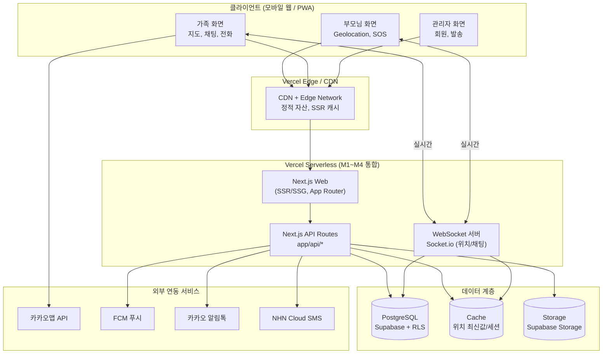
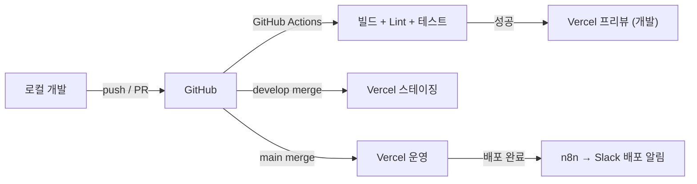

# 인프라 아키텍처

| 항목 | 내용 |
|------|------|
| 프로젝트명 | 부모님 위치 확인 서비스 (안심맵, AnsimMap) |
| 문서 번호 | DOC-10 |
| 문서 버전 | v1.0 |
| 작성일 | 2026-06-03 |
| 작성자 | PM |
| 참조 문서 | PRD.md, 서비스기획서(service_specification.md), 화면설계서(ui_screen_design.md), API스펙(API스펙.md), CLAUDE.md (Tech Stack V0.42) |

시스템의 물리적/논리적 인프라 구성을 정의한다. AP-Framework V0.42 표준 스택(Next.js + Tailwind CSS / Express.js / PostgreSQL / Vercel)과 M1~M4 통합 배포 전략을 기준으로 한다.

---

## 1. 시스템 구성도

### 1.1 논리 구성도

### 1.2 구성 설명

| 계층 | 구성 요소 | 역할 |
|------|-----------|------|
| 클라이언트 | 모바일 웹 브라우저 / PWA | 별도 앱 설치 없이 부모님·가족·관리자 화면 제공. iOS Safari 백그라운드 제약 대응을 위해 PWA 설치 유도 |
| CDN / Edge | Vercel Edge Network | 정적 자산·SSR 응답 캐싱, 전역 분산으로 페이지 로드 3초 이내 목표 |
| Web / API | Next.js (App Router) + API Routes | SSR/SSG 화면 렌더링, REST API 처리. M1~M4는 Vercel 서버리스로 통합 운영 |
| 실시간 | WebSocket (Socket.io) | 30초 간격 위치 공유, SOS 즉시 전파, 가족 채팅 실시간 송수신 |
| Database | PostgreSQL (Supabase) | 회원/가족 그룹/위치 이력/채팅 영속 저장. RLS로 가족 그룹 단위 행 접근 제어 |
| Cache | 위치 최신값·세션 캐시 | 부모님 최신 좌표 등 고빈도 조회 데이터 캐싱으로 DB 부하 완화 |
| Storage | Supabase Storage | 프로필 이미지 등 정적 객체 저장 |

---

## 2. 서버 구성

> M1~M4(현재 기본값)는 Vercel 서버리스 + Supabase 매니지드로 구성하여 별도 서버 프로비저닝/사양 관리가 필요 없다. 아래는 논리적 서비스 단위 기준의 구성이다.

| 구분 | 환경 | 사양 / 플랜 | 용도 |
|------|------|-------------|------|
| Web Server | 개발 / 스테이징 / 운영 | Vercel Serverless (Hobby→Pro), Node.js 20.x | Next.js SSR/SSG 화면 서빙, 정적 자산 제공 |
| API Server | 개발 / 스테이징 / 운영 | Vercel Serverless Functions (메모리 1024MB, 타임아웃 10s) | Next.js API Routes 비즈니스 로직, 외부 API 중계 |
| WebSocket Server | 개발 / 스테이징 / 운영 | Socket.io (M5+ 트래픽 증가 시 Render/Railway 분리) | 실시간 위치 공유·채팅·SOS 전파 |
| DB Server | 개발 / 스테이징 / 운영 | Supabase PostgreSQL 15 (개발 Free, 운영 Pro / 자동 백업) | 영속 데이터 저장, RLS 기반 접근 제어 |
| Cache / Storage | 개발 / 스테이징 / 운영 | Supabase Storage + 인메모리/Redis(M5+ 검토) | 정적 객체, 위치 최신값·세션 캐시 |

### 2.1 백엔드 배치 전략 (V0.42 정책)

| 단계 | API 위치 | 백엔드 배포 | 비고 |
|------|----------|-------------|------|
| M1 ~ M4 (현재) | `src/frontend/app/api/*` (Next.js Route Handlers) | Vercel (Frontend + API 통합) | 인프라 비용 최소화, `src/backend/`는 `.gitkeep` 빈 폴더 |
| M5+ (트래픽 증가 시) | `src/backend/` (Express.js) | Render / Railway / Fly.io | WebSocket·고부하 API 분리 검토 |

---

## 3. 네트워크 구성

| 항목 | 내용 |
|------|------|
| 도메인 (운영) | `ansimmap.vercel.app` (API Base: `https://ansimmap.vercel.app/api`). 커스텀 도메인(예: ansimmap.com)은 정식 출시 시 연결 검토 |
| 도메인 (개발) | `http://localhost:3000` (API Base: `http://localhost:3000/api`) |
| 도메인 (프리뷰) | `<branch>-<project>.vercel.app` (PR 단위 자동 발급) |
| 인증 / 세션 | JWT — httpOnly 쿠키(`access_token`) 자동 전송. 쿠키 Secure·SameSite 속성 적용 |
| SSL / TLS | Vercel 자동 발급·갱신 (Let's Encrypt), 전 구간 HTTPS/TLS 강제. HSTS 적용 |
| DNS | 커스텀 도메인 확정 시 Vercel DNS 또는 외부 등록기관 CNAME 연결 |
| 위치정보 보호 | 전 구간 TLS 암호화, DB 접근 권한 최소화(RLS), 위치 이력 최대 7일 보관 후 자동 삭제 |

### 3.1 방화벽 / 접근 제어 규칙

| 방향 | 규칙 | 비고 |
|------|------|------|
| 인바운드 | 443 (HTTPS) only — 클라이언트 → Vercel Edge | 80(HTTP)은 443으로 리다이렉트 |
| 인바운드 | WebSocket(WSS, 443) — 클라이언트 → Socket.io | TLS 상에서 동작 |
| 아웃바운드 | Vercel → Supabase (REST/RPC, HTTPS) | Supabase IPv6 이슈 회피 위해 REST API/RPC 사용 |
| 아웃바운드 | Vercel → 카카오맵·FCM·알림톡·NHN SMS (HTTPS) | 외부 연동 API 호출 |
| 접근 제어 | 어드민 화면 별도 인증·권한(Role) 분리 | 관리자 전용 라우트 보호 |
| DB 행 보안 | Supabase RLS — 가족 그룹 단위 행 접근 격리 | 타 가족 데이터 조회 차단 |

---

## 4. 배포 환경

| 환경 | URL | 용도 | 배포 방식 |
|------|-----|------|-----------|
| 개발 (Development) | `http://localhost:3000` / `<branch>-<project>.vercel.app` (PR 프리뷰) | 기능 개발·디버깅 | 자동 (PR push 시 Vercel 프리뷰 자동 빌드) |
| 스테이징 (Staging) | `<project>-staging.vercel.app` | QA·통합 테스트, 시니어 UX 검증 | 자동 (develop 브랜치 머지 시) |
| 운영 (Production) | `https://ansimmap.vercel.app` | 실서비스 운영 | 자동 (main 브랜치 머지 시, GitHub Actions + Vercel) |

### 4.1 CI/CD 파이프라인

| 단계 | 도구 | 내용 |
|------|------|------|
| 소스 관리 | GitHub | feature/* → develop → main 브랜치 전략 |
| CI | GitHub Actions | `npm ci` → ESLint → 단위 테스트 → 빌드 검증 |
| CD | Vercel (GitHub 연동) | 프리뷰/스테이징/운영 자동 배포 |
| 배포 알림 | n8n (`03-deploy-notification.json`) | 배포 결과 Slack 통지 |

### 4.2 환경변수 (Vercel 대시보드 등록)

| 변수명 | 용도 |
|--------|------|
| SUPABASE_URL | Supabase 프로젝트 엔드포인트 |
| SUPABASE_KEY | Supabase API 키 (서버 측) |
| DATABASE_URL | PostgreSQL 연결 문자열 |
| JWT_SECRET | 인증 토큰 서명 키 |
| KAKAO_MAP_API_KEY | 카카오맵 JavaScript/REST 키 |
| FCM_SERVER_KEY | FCM 푸시 발송 키 |
| KAKAO_ALIMTALK_API_KEY | 카카오 알림톡 발송 키 |
| SMS_API_KEY | NHN Cloud SMS 발송 키 |

> 서버리스 환경 제약: 네이티브 모듈 금지(bcrypt 대신 bcryptjs 사용), Supabase는 IPv6 전용이므로 REST API의 RPC 함수로 SQL 실행.

---

## 5. 화면 라우트별 호스팅 매핑

> 화면설계서(ui_screen_design.md)의 12개 화면이 인프라 어디에서 서빙되는지 매핑한다. 모든 화면은 동일 Next.js 앱(App Router)에서 서빙되며 플랫폼별 반응형 레이아웃으로 분기한다.

| 화면 ID | 화면명 | 라우트 | 플랫폼 | 호스팅 / 런타임 |
|---------|--------|--------|--------|-----------------|
| SCR-001 | 로그인/회원가입 | `/login`, `/register` | 모바일 웹 | Vercel SSR + `/api/auth/*` |
| SCR-002 | 온보딩 (1~4단계) | `/onboarding/step1~4` | 모바일 웹 | Vercel SSR + `/api/groups/join`, `/api/location/consent` |
| SCR-003 | 부모님 메인 (SOS) | `/parent` | 모바일 웹 | Vercel SSR + `/api/location`, `/api/sos` + WebSocket(위치 송신) |
| SCR-004 | 부모님 설정 | `/parent/settings` | 모바일 웹 | Vercel SSR + `/api/location/consent`, `/api/users/me/settings` |
| SCR-005 | 가족 그룹 생성/참여 | `/family/group/*` | 모바일 웹 | Vercel SSR + `/api/groups`, `/api/groups/join` |
| SCR-006 | 가족 메인 (실시간 지도) | `/family` | 모바일 웹 | Vercel SSR + 카카오맵 + WebSocket(위치 수신) + `/api/location/current` |
| SCR-007 | 위치 이력 조회 | `/family/history` | 모바일 웹 | Vercel SSR + `/api/location/history` (7일 보관 데이터) |
| SCR-008 | 가족 채팅방 | `/family/chat` | 모바일 웹 | Vercel SSR + WebSocket(`/ws`) + `/api/chat/:groupId/messages` |
| SCR-009 | 안전 구역 (지오펜싱) | `/family/geofence` | 모바일 웹 | Vercel SSR + `/api/geofence` (P2) |
| SCR-010 | [관리자] 회원·그룹 목록 | `/admin/groups` | PC 웹 | Vercel SSR + `/api/admin/groups` (role=admin 보호) |
| SCR-011 | [관리자] SMS·알림톡 발송 | `/admin/sms`, `/admin/alimtalk` | PC 웹 | Vercel SSR + `/api/admin/sms`, `/api/admin/alimtalk` → NHN/카카오 |
| SCR-012 | [관리자] 통계 대시보드 | `/admin/stats` | PC 웹 | Vercel SSR + `/api/admin/stats` |

---

## 6. 외부 연동 서비스

| 서비스 | 용도 | 연동 방식 |
|--------|------|-----------|
| 카카오맵 API | 가족 화면 실시간 위치 지도·마커, 주소 변환, 이동 이력 표시 | JavaScript SDK + REST API |
| FCM (Firebase Cloud Messaging) | SOS 긴급 알림, 채팅 알림 푸시 (iOS/Android 크로스) | SDK + Server Key (REST) |
| 카카오 알림톡 API | 관리자 발송 메시지, 재참여 유도 | REST API |
| NHN Cloud SMS | 관리자 대량 발송 백업 채널 | REST API |
| Supabase | PostgreSQL DB, Storage, REST/RPC | REST API / RPC 함수 |
| Socket.io | 실시간 위치 공유·가족 채팅 | WebSocket (WSS) |
| Vercel | 프론트엔드 + API 통합 배포, CDN/Edge | GitHub 연동 자동 배포 |
| GitHub Actions | CI/CD 자동화 | GitHub Webhook |

---

## 7. 비기능 요구사항 대응 (인프라 관점)

| KPI / NFR | 목표 | 인프라 대응 |
|-----------|------|-------------|
| 페이지 로드 시간 | 3초 이내 | Vercel Edge CDN 캐싱, Next.js SSG/ISR |
| SOS 알림 전송 지연 | 3초 이내 | WebSocket 즉시 전파 + FCM 병행 발송 |
| 위치 업데이트 지연 | 5초 이내 | Socket.io 실시간 채널, 위치 최신값 캐시 |
| 채팅 메시지 전송 성공률 | 99% 이상 | 재연결 로직(exponential backoff), 메시지 영속 저장 |
| 서비스 Uptime | 99.5% 이상 | Vercel·Supabase 매니지드 SLA, 무중단 배포 |
| 개인정보 보호 | 유출 0건 | 전 구간 TLS, RLS, 위치 이력 7일 자동 삭제, 접근 권한 최소화 |

---

## 8. 운영 관련 트러블슈팅 (배포 검수 연계)

| 플랫폼 | 이슈 | 해결 |
|--------|------|------|
| Vercel | 네이티브 모듈(`bcrypt`) 빌드 실패 | `bcryptjs`(순수 JS)로 교체 |
| Supabase | IPv6 전용으로 Vercel Lambda(IPv4) 연결 실패 | REST API의 RPC 함수로 SQL 실행 |
| Next.js | `useSearchParams` prerender 에러 | `<Suspense>` 래핑 |
| iOS Safari | 백그라운드 위치 업데이트 중단 | PWA 설치 유도, 포그라운드 유지 안내 |
| FCM | iOS Safari 푸시 미지원 | PWA 설치 후 알림 권한 재요청 |
| WebSocket | 모바일 절전 모드 시 연결 끊김 | 재연결 로직(exponential backoff) 구현 |
