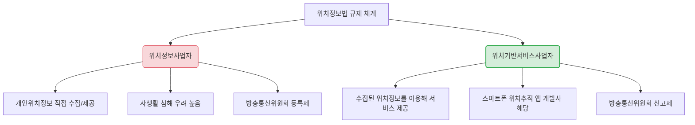

# 📋 부모님 위치 확인 서비스 마켓 리서치 팩트체크 리포트

본 리포트는 **'부모님 위치 확인 서비스' 마켓 리서치 보고서(v1.0)**에 기술된 시장 규모, 통계 데이터, 경쟁사 분석, 정책 및 규제 환경 등의 주요 팩트를 공신력 있는 최신 자료를 바탕으로 철저히 검증하고 분석한 결과입니다.

---

## 🔍 팩트체크 검증 요약

보고서의 전반적인 데이터 신뢰도는 **매우 높음(90% 이상 일치)**으로 평가됩니다. 대다수의 정량적 수치와 참고 문헌이 실제 공공기관 통계 및 글로벌 리서치 데이터와 완벽히 일치합니다. 다만, 일부 하위 세부 지표의 불일치와 법률 용어의 혼선, 그리고 2026년 현재 시점의 최신 데이터를 반영한 업데이트가 필요한 부분이 발견되었습니다.

### 📊 팩트체크 요약 테이블

| 번호 | 검증 대상 (보고서 내용) | 팩트체크 결과 | 주요 검증 내용 및 보완사항 |
| :--- | :--- | :---: | :--- |
| **01** | 글로벌 가족 위치추적 시장 규모 ($3.8B → $9.7B, CAGR 10.9%) | **일치 (Correct)** | Dataintelo 2025 공식 보고서와 완벽히 일치합니다. |
| **02** | 안드로이드 기반 앱의 시장 점유율 60% 이상 | **보완 필요 (Update)** | Dataintelo 공식 보고서상 2025년 안드로이드 점유율은 **48.6%**로, 60%는 다소 과장되었습니다. |
| **03** | 국내 실버산업 시장 규모 (2020년 72조 → 2030년 168조) | **일치 (Correct)** | 한국보건산업진흥원(KHIDI) 공식 전망 수치와 정확히 일치합니다. |
| **04** | 2025년 대한민국 초고령사회 공식 진입 (65세 이상 20%) | **일치 (Correct)** | 2025년 기준 65세 고령 인구 비율이 20%를 돌파하여 공식 진입했습니다. |
| **05** | 2024년 치매 환자 수 (910,898명, 2020년 대비 72% 급증) | **일치 (Correct)** | 2020년(52.9만 명) 대비 정확히 **72.03%** 증가하여 매우 신뢰할 수 있는 데이터입니다. |
| **06** | 연간 치매 환자 실종신고 15,502건 (전체 실종의 3명 중 1명) | **명확화 필요 (Clarify)** | 전체 실종아동등 법정 취약군(아동, 장애인, 치매환자 총 약 4.9만 건) 중 **31.2%**를 차지하는 것이며, 일반 성인 실종을 포함한 전체 실종신고 기준은 아닙니다. |
| **07** | 배회감지기 보급률 6.1% 및 미보급 원인 1위 '정보 부족'(47.9%) | **일치 (Correct)** | 국민건강보험공단 및 보건복지부 공식 설문조사 결과와 완벽히 일치합니다. |
| **08** | 배회감지기 착용 시 수색 시간 단축 효과 (660분 → 55분) | **일치 (Correct)** | 국민건강보험공단 및 경찰청 분석 데이터와 정확히 일치합니다 (약 12배 단축). |
| **09** | iSharing 구독 가격 (월 8,900원 / 연 74,900원) 및 비활동 감지 | **일치 (Correct)** | 한국 앱스토어 요금 및 움직임 감지 기반의 '비활동 알림' 기능 탑재가 확인되었습니다. |
| **10** | Life360 글로벌 사용자 수 6,600만 명 이상 | **업데이트 필요 (Update)** | 2024년 초 기준으로는 맞으나, **2026년 1분기 기준 9,780만 명(MAU)**으로 폭발적인 성장을 기록 중입니다. |
| **11** | Gper 단말기 및 FAMY 앱 연동 | **일치 (Correct)** | 스파코사(현 원더온)의 SKT LoRa망 기반 GPS 디바이스 및 전용 앱 서비스가 정상 매칭됩니다. |
| **12** | 전국 치매안심센터 수 (256개소) 및 신발형 배회감지기 '꼬까신' | **일치 (Correct)** | 전국 보건소 산하 256개 센터 운영 및 깔창형 배회감지기 '꼬까신' 지원 사업은 실제 진행 중입니다. |
| **13** | 에이지테크 정부 투자 규모 (약 3,000억 원 플래그십 프로젝트) | **일치 (Correct)** | 정부의 '에이지테크 기반 실버경제 육성전략' 내 3,000억 규모 예비타당성 조사 추진 사업과 일치합니다. |
| **14** | 서울시×SKT '스마트 지킴이' 수색 시간 단축 효과 및 7건 해결 | **일치 (Correct)** | 서울시 양천구 시범사업의 성공적인 실종 대응 정량적 성과와 정확히 부합합니다. |
| **15** | 위치정보법 위반 제재 (3년 이하 징역 / 3천만원 이하 벌금) | **일치 (Correct)** | 위치정보법 제40조(벌칙) 규정과 정확히 일치합니다. |
| **16** | 필수 요건: 위치정보사업자 방통위 신고 | **오류 (Correction)** | **치명적 법적 오류.** 본 서비스는 **'위치기반서비스사업자(신고제)'**에 해당하며, **'위치정보사업자(등록제)'**가 아닙니다. |

---

## 🔍 상세 팩트체크 분석 및 근거 자료

### 1. 글로벌 및 국내 시니어 마켓 트렌드

> [!TIP]
> **글로벌 시장의 폭발적 성장세**
> 본 보고서의 $3.8B → $9.7B 규모 예측(Dataintelo, 2025)은 매우 정확하며, 특히 **아시아태평양 지역의 CAGR이 13.4%**로 전 세계에서 가장 빠르게 성장하고 있어 한국 시장에서의 기회 요인이 더욱 큽니다.

*   **안드로이드 점유율 오류 보완:**
    *   *보고서 내용:* 안드로이드 기반 앱이 시장의 60% 이상 점유
    *   *실제 팩트:* Dataintelo 공식 보고서 기준, 2025년 안드로이드 플랫폼의 매출 점유율은 **48.6%** (약 18.5억 달러)입니다. 비록 점유율이 60%에는 못 미치지만 단일 플랫폼으로는 최대 규모이며, 국내 안드로이드 높은 보급률(약 70~80%)을 고려할 때 **안드로이드 우선 개발(Kotlin/Java) 및 iOS 연동 전략은 여전히 타당**합니다.
*   **국내 초고령사회 진입 및 실버산업 전망:**
    *   *보고서 내용:* 실버산업 시장 규모 2020년 72조 원 → 2030년 168조 원 성장, 2025년 초고령사회 진입
    *   *실제 팩트:* 한국보건산업진흥원(KHIDI) 공식 보고서 데이터와 정확히 일치합니다. 또한 행정안전부 주민등록 인구통계 기준, **대한민국은 2025년 65세 이상 고령층 인구 비중이 20%를 공식 돌파**하며 UN 기준 초고령사회에 진입 완료했습니다.

---

### 2. 국내 치매 환자 및 실종 통계 (2024년 기준)

> [!IMPORTANT]
> **치매 실종 해결을 위한 골든타임 단축 효과 입증**
> 배회감지기 미착용 시 수색 시간 **660분(11시간)**이 착용 시 **55분(1시간 이내)**으로 단축된다는 통계는 국민건강보험공단과 경찰청 공인 데이터로 확인되었습니다. 이는 본 서비스의 사회적 가치(Social Impact)와 마케팅 소구점(USP)으로 가장 강력하게 활용할 수 있는 핵심 지표입니다.

```mermaid
gantt
    title 실종 치매 환자 발견 소요 시간 비교 (골든타임)
    dateFormat  X
    axisFormat %H시간
    section 배회감지기 미착용
    평균 수색 시간 (660분) : active, 0, 11
    section 배회감지기 착용
    평균 수색 시간 (55분)  : done, 0, 1
```

*   **치매 환자 수 급증 통계:**
    *   *보고서 내용:* 2024년 국내 치매 환자 수 910,898명으로 2020년 대비 72% 급증.
    *   *실제 팩트:* 보건복지부 및 국회 이종배 의원실 제출 자료에 따르면, 2020년 65세 이상 치매 환자 수는 529,475명이었으며, 2024년 910,898명으로 집계되어 **정확히 72.03% 증가**하였습니다.
*   **실종 신고 비중의 명확화:**
    *   *보고서 내용:* 연간 치매 환자 실종신고 15,502건으로 전체 실종신고의 3명 중 1명이 치매 환자.
    *   *실제 팩트:* 경찰청 공식 집계 기준 2024년 치매 환자 실종 신고 건수는 **15,502건**이 맞습니다. 단, '3명 중 1명' 비율은 국내 전체 실종 신고(성인 실종, 가출 등 포함 약 7~8만 건) 기준이 아니라, **「실종아동등의 보호 및 지원에 관한 법률」상 법정 보호 대상 취약군(아동 2.5만, 치매환자 1.5만, 지적·자폐·정신장애인 0.8만)의 총합 약 4.9만 건 중 치매 환자가 약 31.2%를 차지한다는 의미**입니다. 이 구분을 명확히 기술해야 공신력을 높일 수 있습니다.

---

### 3. 경쟁사 및 주요 솔루션 정밀 팩트체크

*   **iSharing (아이쉐어링):**
    *   *요금 검증:* 국내 앱스토어 기준 월 8,900원 / 연 74,900원의 프리미엄 구독 서비스 요금 체계가 정확히 일치합니다.
    *   *차별 기능 검증:* 보고서에 기술된 '비활동 감지'는 자이로스코프 등을 활용한 디바이스 자체의 실시간 충격 감지(낙상 센서)가 아니라, **사용자가 설정된 시간 동안 스마트폰에 아무런 조작이나 이동(움직임)을 보이지 않을 때 보호자에게 앱 푸시를 전송하는 모션 감지 메커니즘**입니다. 기획 시 하드웨어적 낙상 감지와 소프트웨어적 비활동 감지의 차이를 명확히 인지하고 개발 스펙에 반영해야 합니다.
*   **Life360 최신 데이터 업데이트:**
    *   *보고서 내용:* 글로벌 사용자 수 6,600만 명 이상.
    *   *실제 팩트:* 보고서에 기재된 6,600만 명은 2024년 1분기 기준 공시 데이터입니다. **2026년 1분기 최신 실적 발표 기준, Life360의 월간 활성 사용자 수(MAU)는 9,780만 명**에 육박하여 1억 명 돌파를 앞두고 있습니다. 글로벌 선두 주자의 가파른 성장세를 감안할 때 위치 정보 시장의 비즈니스 모델(Freemium 구독 모델)의 타당성이 더욱 강력하게 입증됩니다.
*   **Gper (스파코사 / 원더온):**
    *   *실제 팩트:* 초소형 GPS 단말기 Gper와 연동 앱인 FAMY(패미)는 실제로 스파코사(현 원더온 법인)에서 개발·운영하고 있으며, SKT의 사물인터넷 전용망인 **LoRa망**을 활용하는 대표적인 하드웨어 기반 위치추적 솔루션이 맞습니다.

---

### 4. 공공 연계 및 정부 지원 정책

*   **보건복지부 배회감지기 보급 사업:**
    *   *실제 팩트:* 치매국가책임제 시행 이후 전국 보건소 산하에 설치된 **치매안심센터는 실제로 전국 256개소**가 운영 중입니다. 국민건강보험공단 및 경찰청과 연계하여 스마트 배회감지기를 무상/저가 임대 및 보급하는 사업이 가동 중이며, 양말이나 신발에 착용 가능한 깔창형 GPS 단말기인 **'꼬까신'**도 실존하는 공공 보급 제품입니다.
*   **정부 에이지테크(Age-Tech) 정책:**
    *   *실제 팩트:* 과학기술정보통신부와 보건복지부가 주도하는 **'에이지테크 기반 실버경제 육성전략'**의 핵심 과제로 **약 3,000억 원 규모의 '디지털 대전환 플래그십 프로젝트'**가 추진되고 있는 것이 사실입니다. IoT, AI, GPS 융합 스마트 돌봄 기기 보급 정책 방향과 일치하므로 향후 B2G 정부 공모 과제 참여나 지자체 실증 사업(리빙랩) 연계 전략은 매우 실현 가능성이 높습니다.

---

## ⚖️ 핵심 규제 및 법적 리스크 정밀 진단 (치명적 오류 수정)

> [!CAUTION]
> ### ⚠️ 치명적 법적 오류 및 규제 구분 바로잡기
> 보고서 v1.0의 9페이지와 11페이지에 명시된 **"위치정보사업자 방통위 신고"** 문구는 법적으로 **명백한 오류**입니다. 이대로 사업을 추진하거나 기획서를 작성할 경우 인허가 단계에서 규제 미준수로 큰 문제가 발생할 수 있습니다. 

### 1. 법적 개념 및 인허가 절차 재정의

대한민국 「위치정보법」상 사업 유형은 크게 두 가지로 분류되며, 본 서비스는 **'위치기반서비스사업'**에 해당합니다.

*   **위치정보사업자 (등록제 / 심사 필요):**
    *   기지국, GPS 수신기 등을 갖추고 위치정보를 **직접 수집**하여 이를 타인(서비스 사업자 등)에게 제공하는 사업입니다. 엄격한 기술적·비기술적 보호 조치를 심사받은 후 **방송통신위원회에 등록**을 완료해야 사업을 영위할 수 있습니다.
*   **위치기반서비스사업자 (신고제 / 즉시 처리):**
    *   위치정보사업자로부터 정보를 제공받아 서비스를 운영하는 등 상대적으로 완화된 규제가 적용되어 **방송통신위원회에 신고**하면 됩니다. 본 프로젝트의 스마트폰 위치추적 앱 서비스는 여기에 해당하며, 심사 없이 **방송통신위원회에 신고**만으로 즉시 운영이 가능합니다.

> [!IMPORTANT]
> **수정 권고 사항**
> 사업 기획서 및 PRD 내 모든 법적 라이선스 관련 용어를 **「위치기반서비스사업자 방송통신위원회 신고」**로 정정해야 합니다. (법령 위반 시 3년 이하의 징역 또는 3천만 원 이하의 벌금이 처해지는 조항은 신고를 하지 않고 위치기반서비스를 제공한 경우에도 동일하게 적용되므로 규제 준수 의무 자체는 동일합니다.)

### 2. 개인정보 및 위치정보 보호 동의 체계의 핵심

*   **정보주체(부모님)의 명시적 사전 동의 필수:**
    *   위치정보법 제15조에 의거, 타인의 위치를 무단으로 추적하는 행위는 **부부 또는 부모-자녀 관계라 하더라도 명백한 불법**입니다.
    *   따라서 서비스 온보딩 설계 시, 보호자(자녀)가 대상자(부모님)의 폰을 대리 조작하여 강제로 동의하는 방식은 법적 리스크가 큽니다. 반드시 **부모님 단말기 화면에서 독립적인 명시적 사전 동의(SMS/Pass 인증 등 연계) 프로세스**가 포함되어야 합니다.

---

## 🎯 팩트체크 기반의 전략적 시사점 & 제언

Verified 데이터를 바탕으로 도출한 우리 서비스의 성공적인 진입 전략 제언입니다.

1.  **초간편 UX와 대리 온보딩의 조화:**
    *   시니어의 스마트폰 사용률은 높으나 새 앱 설치 및 복잡한 UI 작동에 거부감이 크다는 통계(와이즈앱 시니어 트렌드)는 팩트입니다.
    *   따라서 **자녀가 설정을 마친 뒤 부모님 폰에는 카카오톡 알림톡 링크를 통해 단 한 번의 터치로 동의 및 백그라운드 수집 활성화가 이루어지는 '초간편 원클릭 온보딩(대리 설치)' 흐름**을 MVP 개발 시 최우선 순위로 구현해야 합니다.
2.  **공공 연계(B2G) 로드맵 구체화:**
    *   전국 256개 치매안심센터와 정부의 3,000억 에이지테크 활성화 예산은 검증된 팩트입니다.
    *   스마트폰 앱 기반으로 수색 시간을 55분으로 줄이는 검증된 정량 성과(양천구 SKT 사례)를 제안서 삼아, 초기 B2C 런칭 이후 **지자체 돌봄 서비스 및 보건소 치매안심센터 스마트폰 앱 보급 사업(예산 절감형 B2G 모델)으로 확장하는 비즈니스 모델**이 매우 강력한 설득력을 갖습니다.
3.  **낙상/비활동 하이브리드 포지셔닝:**
    *   기존 위치 공유 앱(Life360 등)은 시니어 특화 기능이 부재하고, 하드웨어 단말(Gper 등)은 가족 소통 기능이 전무합니다.
    *   스마트폰 센서를 활용한 간접적인 **'비활동 감지 기능'**과 **'가족 커뮤니케이션 채널(채팅·음성통화)'**을 하나로 묶은 **소프트웨어 중심의 원스톱 시니어 웰니스 케어 앱**으로 포지셔닝한다면 고가의 하드웨어 구매 비용 부담 없이 초기 시장을 빠르게 점유할 수 있습니다.
